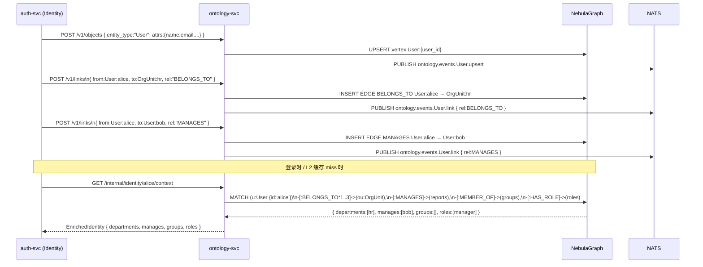
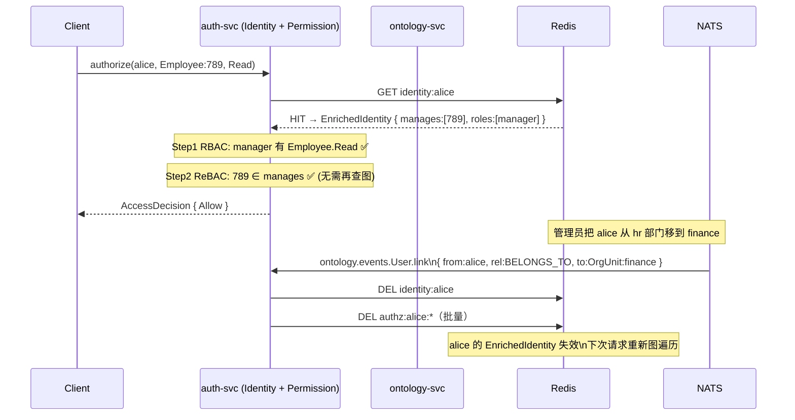
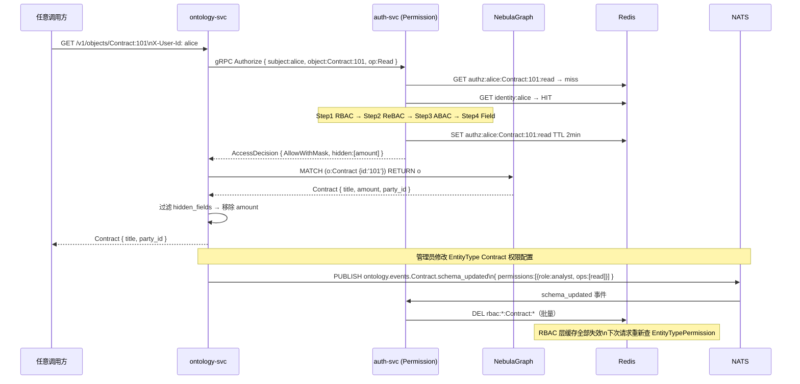
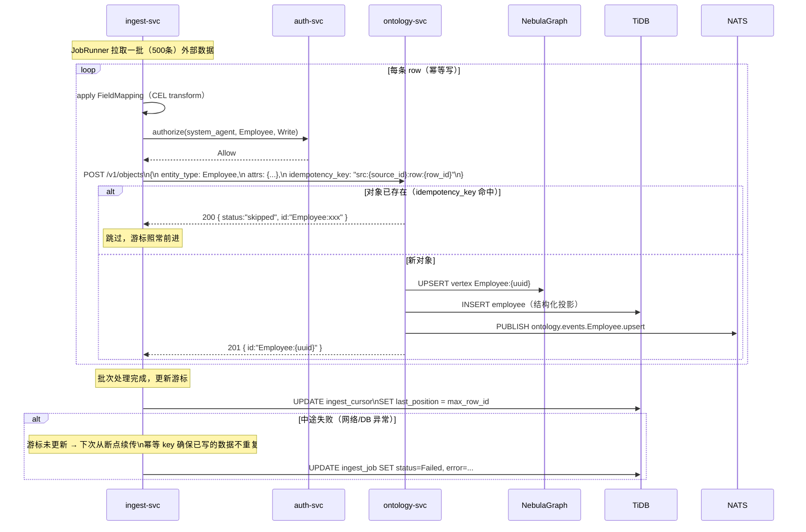
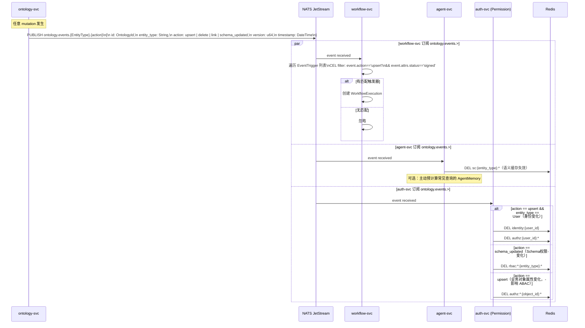
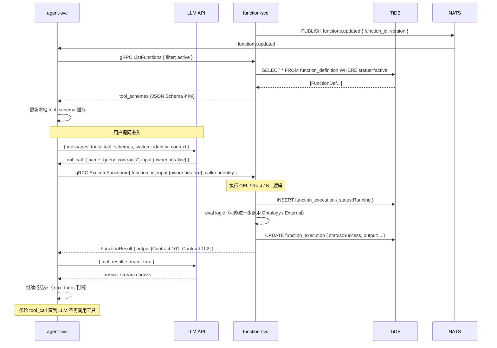
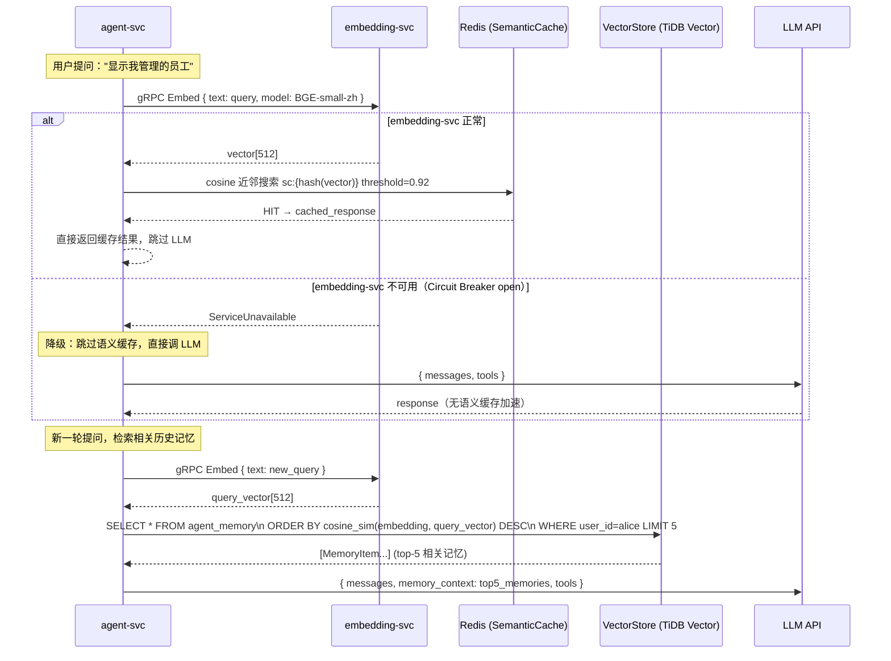
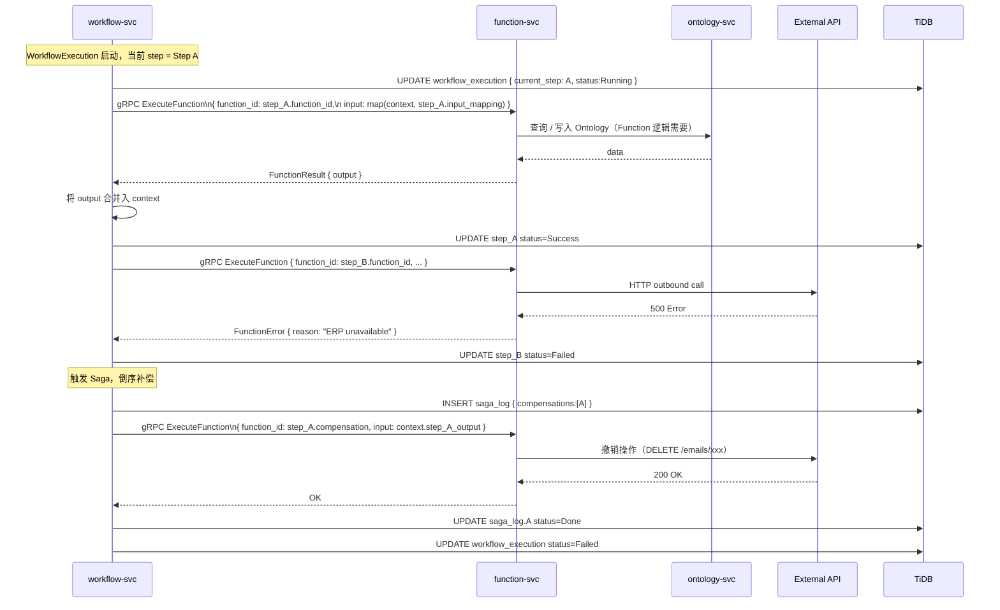
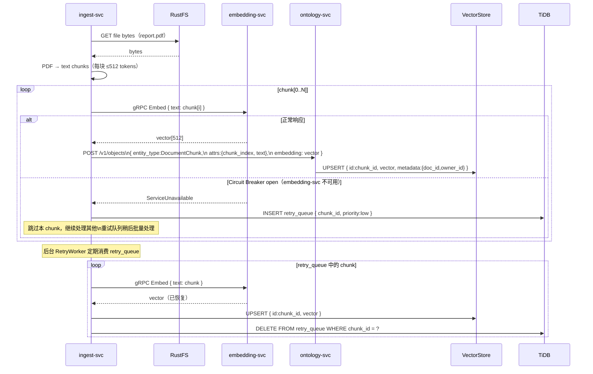

# 跨领域交互清单与交互图

> 版本：v0.1.0 | 日期：2026-03-19
> 关联：user-stories-and-interactions_v0.1.0.md、ontology-permission-interactions_v0.1.1.md

---

## 一、领域交互总览

> 系统共有 7 个核心领域（限界上下文）。下图标出所有存在交互的边。
> 实线 = 同步（gRPC / HTTP）；虚线 = 异步（NATS Event Bus）；双箭头 = 双向。

```
                        ┌─────────────────────┐
                        │      Identity        │
                        │  User/Role/Group/OU  │
                        └──────┬──────┬────────┘
                     BELONGS   │      │ HAS_ROLE / MANAGES
                     图遍历    │      │ （图边，存 Ontology）
                               ▼      ▼
┌──────────────┐   写对象   ┌──────────────────┐   发布事件   ┌──────────────────┐
│   Ingest     │──────────▶│    Ontology       │─ ─ ─ ─ ─ ─▶│   Event Bus      │
│ DataSource   │           │ EntityType(TBox)  │   OntologyEvent  │  NATS JetStream  │
│ FieldMapping │           │ OntologyObject    │              └────────┬─────────┘
│ IngestJob    │           │ OntologyRel.      │                       │ 订阅
│ IngestCursor │           └────────┬──────────┘            ┌─────────┼─────────┐
└──────┬───────┘                    │                        ▼         ▼         ▼
       │                    ◀───────┤ authorize          Workflow   Agent    Permission
       │ embed              │ 每次读写                   (触发)   (预计算)  (缓存失效)
       ▼                    ▼
┌──────────────┐   ◀─── ┌──────────────────┐
│  Embedding   │        │   Permission      │
│  fastembed   │        │ EntityTypePerm.   │
│  BGE-small   │        │ RelationshipRule  │
└──────────────┘        │ AbacPolicy        │
       ▲                │ AccessDecision    │
       │ embed          │ AuditLog          │
       │                └──────────────────┘
┌──────┴───────┐
│    Agent     │──gRPC──▶┌──────────────────┐──HTTP──▶ External API
│ AgentSession │         │    Function       │
│ AgentMessage │◀────────│ FunctionDef.      │◀──────── Workflow
│ AgentMemory  │  结果   │ FunctionExec.     │  步骤执行
│ SemanticCache│         │ OutboundConfig    │
└──────────────┘         └──────────────────┘
       │                          │
       └──────────────────────────┘
              均通过 Ontology 读写业务数据
```

---

## 二、跨领域交互明细

### 交互矩阵

| 发起方 | 接收方 | 方向 | 通信方式 | 触发 Story | 参考 Flow |
|--------|--------|------|---------|-----------|----------|
| Identity | Ontology | → | 图存储（User 是 ABox 对象） | US-23/24 | — |
| Identity | Permission | → | 同步 gRPC（图遍历派生 EnrichedIdentity） | US-20/31 | Flow 1/2 |
| Ingest | Ontology | → | 同步 HTTP（写 OntologyObject） | US-02/03/04 | Flow 7 |
| Ingest | Embedding | → | 同步 gRPC（文件分片向量化） | US-70/71 | Flow 10 |
| Ontology | Permission | ↔ | 同步 gRPC（每次读写调用 authorize） | US-30~35 | Flow 2/3 |
| Ontology | Event Bus | → | 异步 NATS Publish（每次 mutation） | US-12/14/34 | Flow 3/6/7 |
| Event Bus | Workflow | → | 异步 NATS Subscribe（事件触发） | US-62 | Flow 8 |
| Event Bus | Agent | → | 异步 NATS Subscribe（缓存失效/预计算） | US-42 | Flow 6/7 |
| Event Bus | Permission | → | 异步 NATS Subscribe（权限缓存失效） | US-34 | Flow 6 |
| Agent | Embedding | → | 同步 gRPC（query 向量化，语义缓存） | US-42 | Flow 5/9 |
| Agent | Function | → | 同步 gRPC（工具调用） | US-51 | Flow 9 |
| Agent | Ontology | → | 同步 HTTP（携带用户身份读数据） | US-40/43 | Flow 5 |
| Workflow | Function | → | 同步 gRPC（步骤执行） | US-60/63 | Flow 8 |
| Workflow | Ontology | → | 同步 HTTP（步骤结果写回） | US-60 | Flow 8 |
| Function | Ontology | → | 同步 HTTP（CEL 查询/写入 Ontology） | US-50 | Flow 9 |
| Function | External | → | 同步 HTTP（outbound 集成） | US-52 | Flow 8/9 |
| Permission | Identity | → | 同步 gRPC（查 EnrichedIdentity） | US-31/34 | Flow 2 |

---

## 三、有交互的领域对 — 独立交互图

下面对每一个有实质交互的领域对，画出专项交互图。

---

### Pair 1：Identity ↔ Ontology

> **交互本质**：User 本身就是 ABox 对象，MANAGES / BELONGS_TO / MEMBER_OF 是图边，存在 NebulaGraph 中。
> **方向**：Identity 写身份数据到 Ontology；Ontology 图遍历反过来为 Permission 提供 EnrichedIdentity。



---

### Pair 2：Identity ↔ Permission

> **交互本质**：Permission 评估依赖 EnrichedIdentity（来自 Identity/Ontology 图遍历）；Identity 变更触发权限缓存失效。
> **方向**：双向。Permission 查 Identity；Identity 变更通知 Permission。



---

### Pair 3：Ontology ↔ Permission

> **交互本质**：Ontology 的每次读/写都同步调用 auth-svc.authorize()；Permission 配置变更（Schema 修改）发布事件触发 RBAC 缓存失效。
> **方向**：双向。Ontology 每次操作调 Permission；Permission 通过 Event Bus 反向通知。



---

### Pair 4：Ingest → Ontology

> **交互本质**：ingest-svc 是外部数据进入 Ontology 的唯一入口；写入时带幂等 key 防止重复；失败时游标回退续传。
> **方向**：单向写。Ingest → Ontology。



---

### Pair 5：Ontology → Event Bus → 下游三方

> **交互本质**：Ontology 每次 mutation（写/删/链接/Schema变更）发布 OntologyEvent 到 NATS；Workflow / Agent / Permission 三方独立订阅、独立消费。
> **方向**：Ontology 单向发布；下游各自独立消费（扇出）。



---

### Pair 6：Agent ↔ Function

> **交互本质**：Agent 是 Function 的最大消费方。LLM 规划阶段选择工具；执行阶段同步 gRPC 调用 function-svc；结果返回给 LLM 合成回答。
> **方向**：Agent 单向调用 Function（同步）；Function 把工具列表变更通知 Agent（异步）。



---

### Pair 7：Agent ↔ Embedding

> **交互本质**：Agent 在两个场景依赖 Embedding：① 语义缓存（query 向量化 → 近邻搜索）；② AgentMemory 检索（历史记忆向量化）。
> **降级策略**：Embedding 不可用时，Agent 跳过语义缓存，直接走 LLM。



---

### Pair 8：Workflow ↔ Function

> **交互本质**：Workflow 是 Function 的另一大消费方。每个 WorkflowStep 对应一次 Function 调用；Saga 补偿也通过调用补偿 Function 实现。
> **方向**：Workflow 单向调用 Function（同步）。



---

### Pair 9：Ingest → Embedding（文件向量化）

> **交互本质**：文件摄入时，ingest-svc 对文本分片后调用 embedding-svc 向量化，写入 VectorStore 供语义搜索。
> **方向**：Ingest 单向调用 Embedding（同步，带断路器降级）。



---

## 四、关键交互规则总结

| 规则 | 说明 |
|------|------|
| **Ontology 是数据写入的唯一入口** | 任何服务（Ingest / Workflow / Function）不能绕过 ontology-svc 直接写 NebulaGraph / TiDB |
| **Permission 是 Ontology 读写的守门人** | ontology-svc 每次操作前同步调用 auth-svc.authorize()，无例外 |
| **User 是 Ontology 的一等公民** | User 存储为 ABox 对象，图关系在 NebulaGraph，ReBAC 才能统一图遍历 |
| **Event Bus 是唯一的跨领域异步通道** | 领域间异步通知不通过 HTTP 回调，全部走 NATS OntologyEvent |
| **Function 是出站集成的唯一出口** | HTTP outbound 请求只能通过 function-svc，不允许其他服务直连外网（ADR-22）|
| **Embedding 是可降级的非关键路径** | Embedding 不可用时，Agent 降级跳过语义缓存，核心查询链路不中断 |
| **缓存失效由事件驱动，非轮询** | 所有 Redis 缓存失效通过 NATS 事件主动触发，auth-svc 订阅消费 |

---

## 五、与既有 Flow 对应关系

| 本文 Pair | 对应已有 Flow（ontology-permission-interactions_v0.1.1.md）| 对应新 Flow（user-stories-and-interactions_v0.1.0.md）|
|-----------|------------------------------------------------------|-----------------------------------------------------|
| Pair 1 Identity ↔ Ontology | Flow 1（登录时图遍历） | — |
| Pair 2 Identity ↔ Permission | Flow 1（EnrichedIdentity 缓存）/ Flow 6（缓存失效） | — |
| Pair 3 Ontology ↔ Permission | Flow 2（读取三级缓存）/ Flow 3（写入 Deny）/ Flow 4（Schema 变更）| — |
| Pair 4 Ingest → Ontology | — | Flow 7（摄入全链路）|
| Pair 5 Ontology → Event Bus → 三方 | Flow 6（缓存失效）| Flow 7（下游消费）|
| Pair 6 Agent ↔ Function | Flow 5（Agent 查询工具调用）| Flow 9（Function 注册）|
| Pair 7 Agent ↔ Embedding | Flow 5（语义缓存检查）| Flow 9（语义缓存写入）|
| Pair 8 Workflow ↔ Function | — | Flow 8（Saga 补偿）|
| Pair 9 Ingest → Embedding | — | Flow 10（文件向量化）|

---

## 版本历史

| 版本 | 日期 | 变更内容 |
|------|------|---------|
| v0.1.0 | 2026-03-19 | 初始版本：9 个跨领域交互对，领域交互总览图，交互规则总结 |
