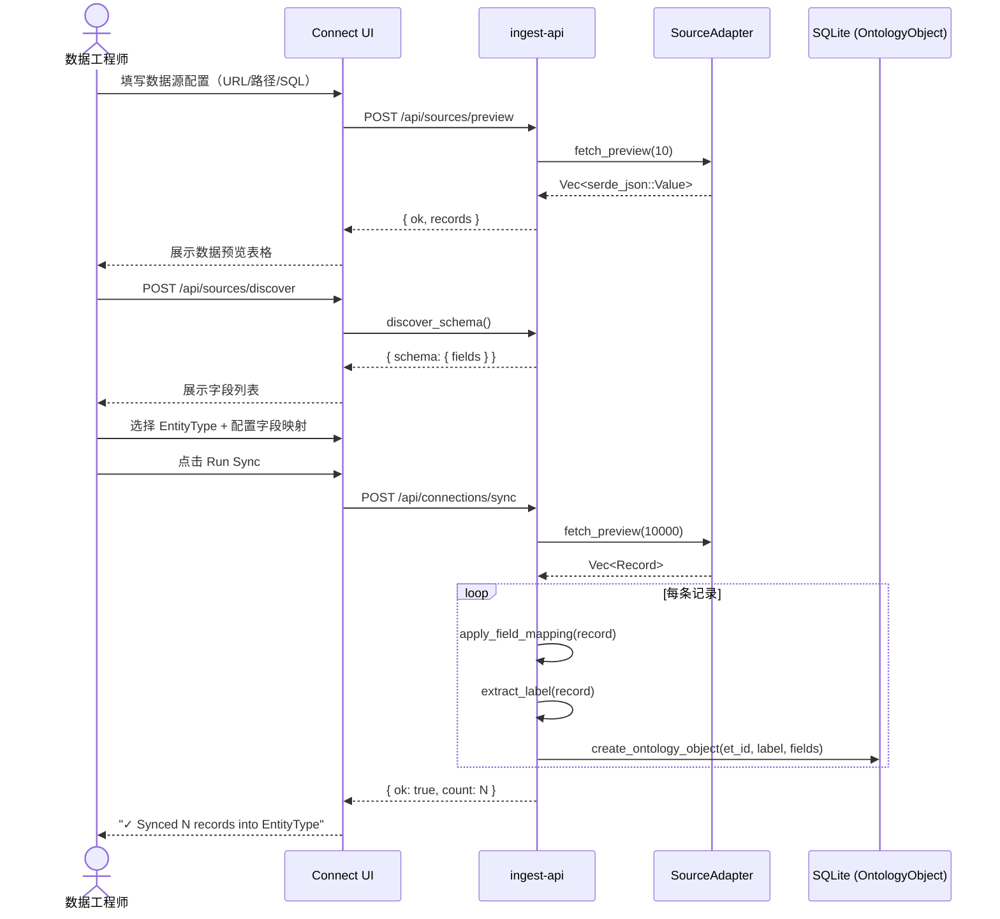
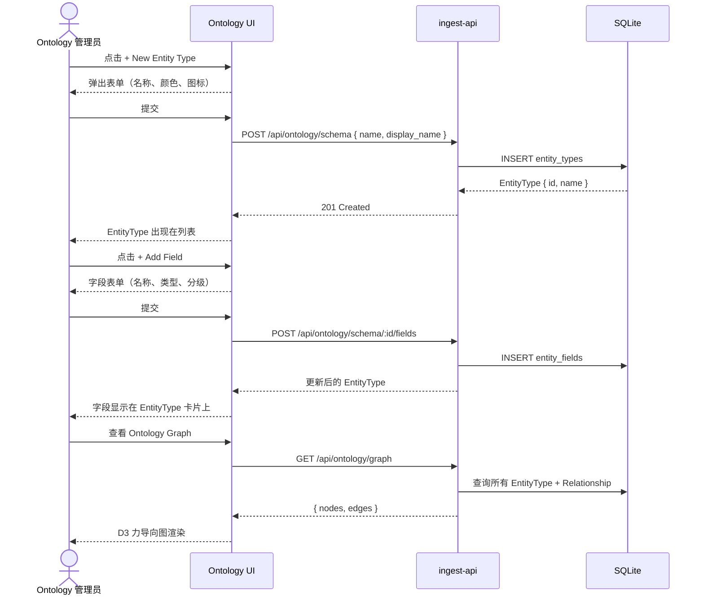
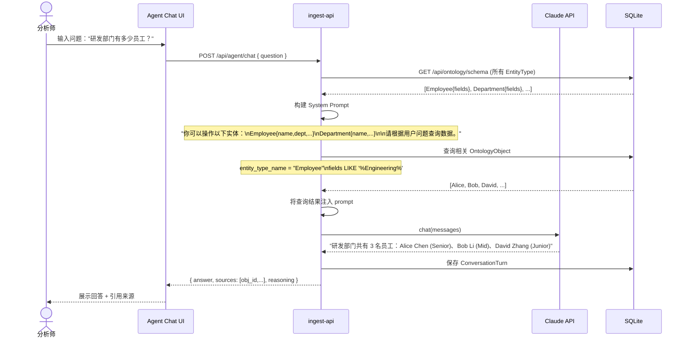
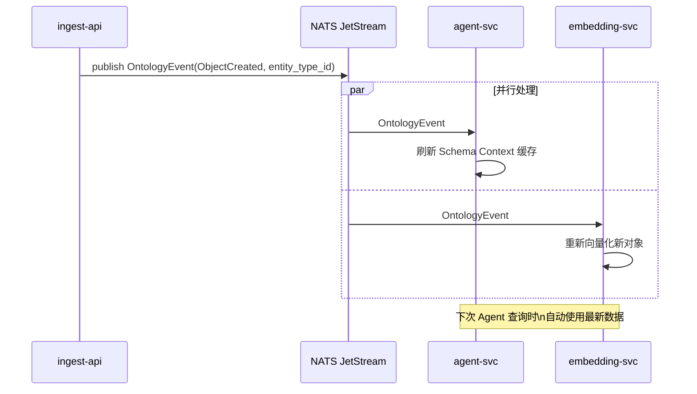

# 领域模型推导 v0.1.0

> 方法：User Story → Event Storming → 领域模型 → 交互流程图
> 阶段：MVP（Data Connection → Ontology → Agent 对话）
> 日期：2026-03-19

---

## 一、核心用户故事（MVP 阶段）

聚焦三类角色，每类取最关键的故事。

### 数据工程师（Data Engineer）

| ID | 用户故事 |
|----|---------|
| DE-01 | 作为数据工程师，我想**注册一个数据源**（CSV/JSON/SQL/REST），以便后续将数据同步进 Ontology |
| DE-02 | 作为数据工程师，我想**预览数据源的前 N 条记录**，以便确认数据质量再决定是否导入 |
| DE-03 | 作为数据工程师，我想**自动发现数据源的字段结构**，以便快速建立 Ontology EntityType |
| DE-04 | 作为数据工程师，我想**将数据源字段映射到 EntityType 字段**，以便控制哪些字段进入 Ontology |
| DE-05 | 作为数据工程师，我想**触发同步（Sync）**，将数据源记录批量写入 OntologyObject |
| DE-06 | 作为数据工程师，我想**查看同步结果**（成功条数、错误信息），以便确认数据已正确入库 |

### Ontology 管理员（Ontology Manager）

| ID | 用户故事 |
|----|---------|
| OM-01 | 作为 Ontology 管理员，我想**定义 EntityType**（名称、字段、类型），建立业务实体的语义模型 |
| OM-02 | 作为 Ontology 管理员，我想**查看所有 OntologyObject**（按 EntityType 过滤），以便监控数据质量 |
| OM-03 | 作为 Ontology 管理员，我想**定义实体之间的关系类型**（RelationshipType），以便描述业务连接 |
| OM-04 | 作为 Ontology 管理员，我想**在对象之间建立关系链接**，以便构建知识图谱 |

### 分析师 / 业务用户（Analyst）

| ID | 用户故事 |
|----|---------|
| AN-01 | 作为分析师，我想**用自然语言提问**（"研发部门有多少人？"），Agent 能够理解并返回准确答案 |
| AN-02 | 作为分析师，我想 **Agent 能理解业务实体的语义**（知道 Employee、Department 是什么），而不是让我写 SQL |
| AN-03 | 作为分析师，我想**看到 Agent 的推理过程**（查了哪些数据、用了什么逻辑），以便验证答案可信度 |
| AN-04 | 作为分析师，我想**对话历史被保留**，以便追问和深入分析 |

---

## 二、Event Storming：从用户故事提取领域事件

### 方法说明

```
用户故事中的动词 → Command（命令）
Command 执行成功 → Domain Event（领域事件）
多个事件的发起者 → Aggregate（聚合）
跨聚合协作 → Domain Service / Policy
```

### 提取过程

**从 DE 系列故事：**

| Command | Domain Event | 触发者 |
|---------|-------------|--------|
| RegisterConnection | ConnectionRegistered | DataEngineer |
| PreviewData | DataPreviewed | DataEngineer |
| DiscoverSchema | SchemaDiscovered | DataEngineer |
| MapFields | FieldMappingDefined | DataEngineer |
| TriggerSync | SyncStarted | DataEngineer |
| — | RecordIngested(×N) | System |
| — | SyncCompleted(count) | System |
| — | SyncFailed(reason) | System |

**从 OM 系列故事：**

| Command | Domain Event | 触发者 |
|---------|-------------|--------|
| CreateEntityType | EntityTypeCreated | OntologyManager |
| AddField | FieldAdded | OntologyManager |
| CreateRelationshipType | RelationshipTypeDefined | OntologyManager |
| LinkObjects | ObjectLinked | OntologyManager |

**从 AN 系列故事：**

| Command | Domain Event | 触发者 |
|---------|-------------|--------|
| AskQuestion | QuestionReceived | Analyst |
| — | SchemaContextInjected | AgentSvc |
| — | OntologyQueried | AgentSvc |
| — | AnswerGenerated | LLM |
| — | ConversationTurnSaved | AgentSvc |

---

## 三、领域模型（聚合 + 实体 + 值对象）

### 3.1 有界上下文划分

从事件聚类，识别出 4 个有界上下文：

```
┌─────────────────────┐  ┌──────────────────────┐
│  Connection Context  │  │  Ontology Context     │
│  （数据接入）         │  │  （语义建模）          │
│                      │  │                      │
│  Connection          │  │  EntityType           │
│  FieldMapping        │  │  FieldDef             │
│  SyncRun             │  │  OntologyObject       │
│                      │  │  ObjectRelationship   │
└─────────┬───────────┘  └──────────┬───────────┘
          │ SyncCompleted                │ ObjectCreated
          └─────────────┬───────────────┘
                        ▼
          ┌─────────────────────────┐
          │   Ingest Pipeline       │
          │   CanonicalRecord       │
          │   FieldMappingApplied   │
          └───────────┬─────────────┘
                      │ OntologyObject persisted
                      ▼
          ┌─────────────────────────┐
          │   Agent Context         │
          │   （对话与推理）          │
          │                        │
          │   Conversation          │
          │   ConversationTurn      │
          │   AgentMemory           │
          └─────────────────────────┘
```

### 3.2 各聚合的核心模型

#### Connection（数据连接聚合）

```
Connection {
  id:           ConnectionId          // 聚合根 ID
  name:         String
  src_type:     SourceType            // CSV | JSON | SQL | REST
  src_config:   SourceConfig          // 值对象：各类型配置参数
  field_mapping: FieldMapping         // 值对象：source_field → ontology_field
  entity_type_id: EntityTypeId        // 目标 EntityType
  status:       ConnectionStatus      // Idle | Syncing | Ok | Error
  last_sync_at: Option<DateTime>
  record_count: Option<u64>
}

SyncRun {                              // 同步执行记录（Connection 的子实体）
  id:           SyncRunId
  connection_id: ConnectionId
  started_at:   DateTime
  finished_at:  Option<DateTime>
  status:       SyncStatus            // Running | Completed | Failed
  record_count: u64
  error:        Option<String>
}
```

#### Ontology（语义建模聚合）

```
EntityType {                           // 聚合根：实体类型定义（TBox）
  id:           EntityTypeId
  name:         String                 // "Employee", "Contract"
  display_name: String
  fields:       Vec<FieldDef>
  color:        String
  icon:         String
}

FieldDef {                             // 值对象：字段定义
  id:           FieldId
  name:         String
  data_type:    DataType               // String | Number | Date | Reference | ...
  classification: Classification      // Public | Internal | Confidential | PII
  is_required:  bool
  is_indexed:   bool
}

OntologyObject {                       // 聚合根：实体实例（ABox）
  id:           ObjectId              // UUIDv7
  entity_type_id: EntityTypeId
  entity_type_name: String
  label:        String                 // 显示名
  fields:       Map<FieldName, Value>  // 实际数据
  source_id:    Option<ConnectionId>  // 来自哪个 Connection
  created_at:   DateTime
  updated_at:   DateTime
}

ObjectRelationship {                   // 关系实例
  id:           RelId
  source_id:    ObjectId
  target_id:    ObjectId
  rel_type:     String
  properties:   Map<String, Value>
}
```

#### Agent（对话聚合）

```
Conversation {                         // 聚合根
  id:           ConversationId
  title:        String
  turns:        Vec<ConversationTurn>
  created_at:   DateTime
}

ConversationTurn {                     // 实体
  id:           TurnId
  role:         Role                   // User | Assistant
  content:      String
  reasoning:    Option<String>         // Agent 的推理过程（透明度）
  sources:      Vec<ObjectId>          // 引用了哪些 OntologyObject
  created_at:   DateTime
}
```

---

## 四、交互流程图

### Flow 1：数据工程师注册连接并同步数据



---

### Flow 2：Ontology 管理员定义语义模型



---

### Flow 3：分析师通过 Agent 提问



---

### Flow 4：数据变更触发 Agent 上下文刷新（事件驱动，规划中）



---

## 五、推导总结：从 US 到代码的映射

| 用户故事 | 领域概念 | 当前实现位置 |
|---------|---------|------------|
| DE-01 注册数据源 | Connection 聚合 | `connect.html` + localStorage |
| DE-02 预览数据 | SourceAdapter.fetch_preview | `adapters_*.rs` + `/api/sources/preview` |
| DE-03 发现 Schema | SourceAdapter.discover_schema | `adapters_*.rs` + `/api/sources/discover` |
| DE-04 字段映射 | FieldMapping 值对象 | `connect.html` Step 3 + `apply_field_mapping()` |
| DE-05 触发同步 | SyncRun 子实体 | `/api/connections/sync` handler |
| DE-06 同步结果 | SyncCompleted 事件 | `{ ok, count }` 响应 |
| OM-01 定义 EntityType | EntityType 聚合根 | `ontology.html` + `/api/ontology/schema` |
| OM-02 查看 Objects | OntologyObject 聚合根 | `/api/ontology/objects` |
| OM-03/04 关系建模 | ObjectRelationship | `/api/ontology/links` |
| AN-01 自然语言提问 | Conversation 聚合 | `/api/agent/chat` **（待实现）** |
| AN-02 语义理解 | Schema Context 注入 | LlmProvider + System Prompt **（待实现）** |
| AN-03 推理过程 | ConversationTurn.reasoning | **（待实现）** |

---

## 六、下一步实现优先级

```
P0（本周）
  ├─ /api/agent/chat 接口（接 Claude API，注入 schema context）
  └─ agent.html 对话界面

P1（下周）
  ├─ Connection 持久化（存 SQLite，不只存 localStorage）
  ├─ SyncRun 记录（每次 sync 写历史）
  └─ OntologyObject 列表页（在 ontology.html 展示导入的数据）

P2（后续）
  ├─ NATS 事件总线（Flow 4）
  ├─ embedding-svc（语义缓存）
  └─ Agent Memory 积累
```
