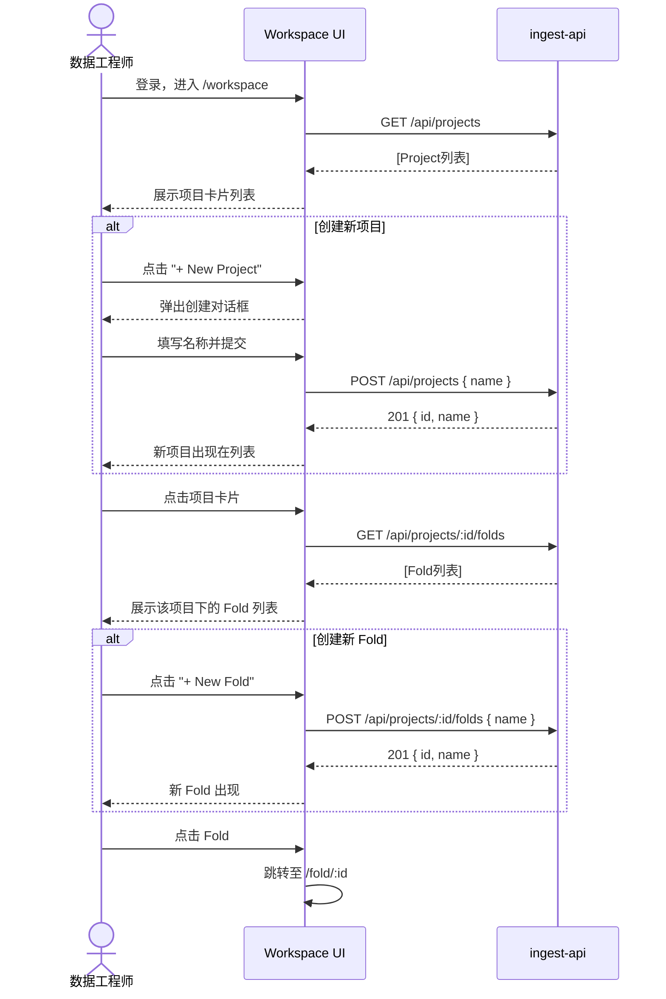
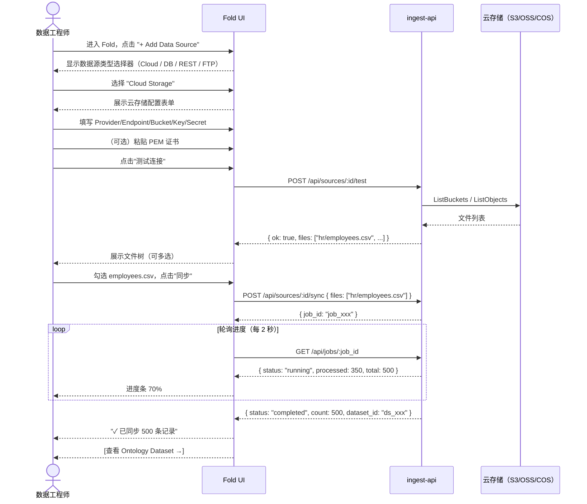
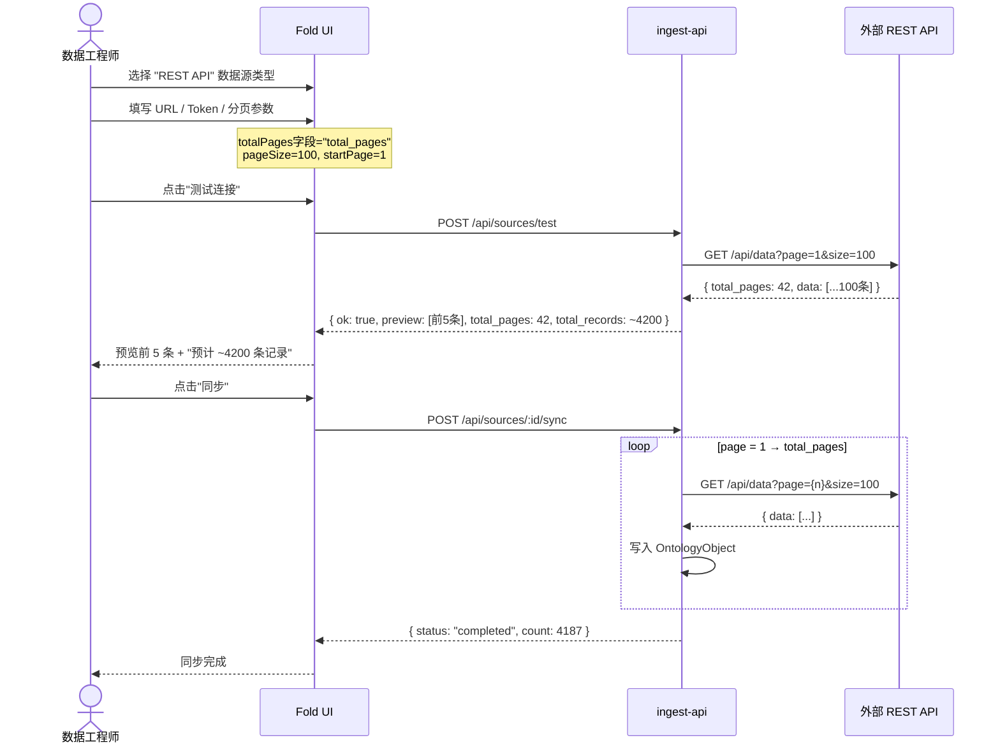
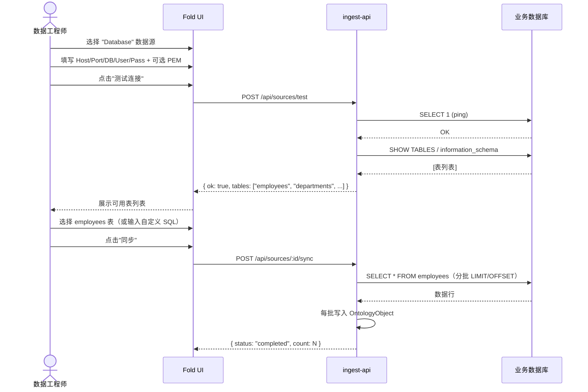

# 数据接入工作流设计 v0.1.0

> 阶段：Ingest MVP — 外部数据源 → Ontology Dataset
> 日期：2026-03-19

---

## 一、用户故事（润色版）

### Epic：数据接入（Data Ingestion）

**US-01 进入工作台**
> 作为**数据工程师**，当我登录平台后，我想看到属于我的所有**项目列表**，
> 以便快速定位或创建工作上下文。

**US-02 管理项目**
> 作为**数据工程师**，我想**创建新项目**或**选择已有项目**进入，
> 因为不同业务需求对应不同的数据集和权限边界。

**US-03 管理业务域（Fold）**
> 作为**数据工程师**，进入项目后，我想看到该项目下所有的**业务域（Fold）列表**，
> 每个 Fold 代表一个独立的业务数据集组（如"人力资源"、"财务报表"、"客户数据"）。
> 我可以选择已有 Fold 继续工作，或**创建新 Fold** 以支持新的业务线。

**US-04 配置云存储数据源**
> 作为**数据工程师**，在 Fold 内，我想**连接云端对象存储**（AWS S3 / 阿里云 OSS / 腾讯云 COS / 华为 OBS），
> 具体流程为：
> 1. 选择云服务商并填写 Endpoint、Bucket、Access Key、Secret Key
> 2. 可选：上传 SSL/PEM 证书文件以满足私有化部署的 TLS 要求
> 3. 点击"测试连接"，成功后系统展示 Bucket 内的文件列表
> 4. 勾选目标 CSV 文件（支持多选）并点击"同步"
> 5. 系统将文件内容拉取到平台，并**自动生成 Ontology Dataset**

**US-05 配置关系型数据库数据源**
> 作为**数据工程师**，在 Fold 内，我想**连接关系型数据库**（MySQL / PostgreSQL / SQL Server），
> 具体流程为：
> 1. 填写连接名称、数据库类型、Host、Port、数据库名、用户名、密码
> 2. 可选：上传 PEM 证书（用于 TLS 加密连接，如 RDS SSL）
> 3. 点击"测试连接"，成功后系统展示可用的**数据表列表**
> 4. 选择目标表或输入自定义 SQL 查询
> 5. 点击"同步"，数据写入平台并**自动生成 Ontology Dataset**

**US-06 配置 REST API 数据源**
> 作为**数据工程师**，在 Fold 内，我想**连接 REST API**，
> 具体流程为：
> 1. 填写 API 基础 URL 和认证信息（Bearer Token / API Key / Basic Auth）
> 2. 配置分页参数：
>    - 总页数字段名（如 `totalPages`）
>    - 当前页字段名（如 `page`）
>    - 每页记录数（如 `pageSize = 100`）
>    - 起始页码（如 `1` 或 `0`）
> 3. 点击"测试连接"，系统拉取第一页并展示数据预览
> 4. 点击"同步"，系统自动分页拉取所有数据并**生成 Ontology Dataset**

**US-07 配置 FTP 数据源**
> 作为**数据工程师**，在 Fold 内，我想**连接 FTP/SFTP 服务器**，
> 具体流程为：
> 1. 选择协议（FTP / FTPS / SFTP）、填写 Host、Port、用户名、密码
> 2. SFTP 场景：上传 SSH 私钥（PEM 格式）替代密码
> 3. 填写远程目录路径和文件过滤规则（如 `*.csv`）
> 4. 点击"测试连接"，成功后展示匹配的文件列表
> 5. 勾选目标文件并点击"同步"，系统下载并**生成 Ontology Dataset**

**US-08 查看同步状态**
> 作为**数据工程师**，同步任务启动后，我想看到**实时进度**（已处理记录数 / 总数、耗时）
> 以及最终结果（成功条数、错误信息），以便确认数据已正确入库。

**US-09 查看 Ontology Dataset**
> 作为**数据工程师**，同步完成后，我想**直接跳转**到生成的 Ontology Dataset
> 查看数据结构和记录，以便验证数据质量，或将数据集交给分析师使用。

---

## 二、分析过程

### 2.1 Event Storming 提取

从用户故事的动词中提取 Command 和 Domain Event：

| Command | Domain Event | 触发条件 |
|---------|-------------|---------|
| CreateProject | ProjectCreated | 用户手动创建 |
| SelectProject | — | 导航动作（无持久化） |
| CreateFold | FoldCreated | 用户手动创建 |
| SelectFold | — | 导航动作 |
| ConfigureDataSource | DataSourceConfigured | 填写并保存配置 |
| TestConnection | ConnectionTested(ok/fail) | 用户点击测试 |
| BrowseFiles | FilesListed | 连接成功后自动触发 |
| SelectFiles | FilesSelected | 用户勾选文件 |
| TriggerSync | SyncJobStarted | 用户点击同步 |
| — | RecordIngested(×N) | 系统逐条处理 |
| — | SyncJobCompleted(count) | 全部处理完毕 |
| — | SyncJobFailed(reason) | 出现错误 |
| — | OntologyDatasetCreated | SyncJobCompleted 触发 |

### 2.2 关键业务规则

1. **一个 Fold 可以有多个 DataSource**，每个 DataSource 独立同步
2. **同步是幂等的**：重复同步同一数据源时，通过 `external_id` 去重（upsert）
3. **PEM 证书安全存储**：不明文存 DB，加密后存储（MVP 阶段存加密字符串）
4. **分页 REST API**：系统自动翻页直到无数据，无需用户手动控制
5. **云存储文件**：支持多文件选择，系统逐文件处理并合并到同一 Dataset

---

## 三、领域模型

### 3.1 聚合与实体

```
┌─────────────────────────────────────────────────────────────────┐
│  Project（聚合根）                                               │
│  id: ProjectId                                                   │
│  name: String                                                    │
│  description: String                                             │
│  created_at: DateTime                                            │
│                                                                  │
│  folds: Vec<Fold>  ────────────────────┐                        │
└────────────────────────────────────────│────────────────────────┘
                                         │
┌────────────────────────────────────────▼────────────────────────┐
│  Fold（实体）                                                    │
│  id: FoldId                                                      │
│  project_id: ProjectId                                           │
│  name: String             # "人力资源" / "财务报表"              │
│  description: String                                             │
│  created_at: DateTime                                            │
│                                                                  │
│  data_sources: Vec<DataSource>  ──────────────────┐             │
└───────────────────────────────────────────────────│─────────────┘
                                                    │
┌───────────────────────────────────────────────────▼─────────────┐
│  DataSource（聚合根）                                            │
│  id: DataSourceId                                                │
│  fold_id: FoldId                                                 │
│  name: String                                                    │
│  source_type: DataSourceType  # S3 | DB | REST | FTP            │
│  config: DataSourceConfig     # 值对象，按类型区分              │
│  status: DataSourceStatus     # Idle | Testing | Syncing | Ok | Error │
│  last_sync_at: Option<DateTime>                                  │
│  record_count: Option<u64>                                       │
│                                                                  │
│  sync_jobs: Vec<SyncJob>  ──────────────────────┐               │
└─────────────────────────────────────────────────│───────────────┘
                                                  │
┌─────────────────────────────────────────────────▼───────────────┐
│  SyncJob（实体）                                                 │
│  id: SyncJobId                                                   │
│  data_source_id: DataSourceId                                    │
│  status: SyncStatus   # Pending | Running | Completed | Failed  │
│  total_records: Option<u64>                                      │
│  processed_records: u64                                          │
│  error_message: Option<String>                                   │
│  started_at: DateTime                                            │
│  finished_at: Option<DateTime>                                   │
└─────────────────────────────────────────────────────────────────┘
```

### 3.2 DataSourceConfig 值对象（按类型）

```
CloudStorageConfig {
  provider:   CloudProvider     # AWS_S3 | Aliyun_OSS | Tencent_COS | Huawei_OBS | MinIO
  endpoint:   String            # https://oss-cn-hangzhou.aliyuncs.com
  bucket:     String
  access_key: String
  secret_key: String (encrypted)
  pem_cert:   Option<String>    # PEM 证书内容（加密存储）
  selected_files: Vec<String>   # 已选择的文件路径列表
}

DatabaseConfig {
  db_type:   DbType             # MySQL | PostgreSQL | SqlServer
  name:      String             # 连接别名
  host:      String
  port:      u16
  database:  String
  username:  String
  password:  String (encrypted)
  pem_cert:  Option<String>
  query:     String             # 自定义 SQL 或表名
}

RestApiConfig {
  base_url:         String
  auth_type:        AuthType    # None | Bearer | ApiKey | Basic
  auth_value:       String      # token / key / base64(user:pass)
  records_path:     String      # 响应体中数组的 JSON Path，如 "data.items"
  pagination: PaginationConfig {
    total_pages_field: String   # 如 "totalPages"
    current_page_field: String  # 如 "page"
    page_size:         u32      # 每页记录数
    start_page:        u32      # 起始页码（0 或 1）
    page_param:        String   # URL 中的页码参数名
    size_param:        String   # URL 中的每页大小参数名
  }
}

FtpConfig {
  protocol:    FtpProtocol      # FTP | FTPS | SFTP
  host:        String
  port:        u16
  username:    String
  password:    Option<String>
  pem_key:     Option<String>   # SSH 私钥（SFTP 场景）
  remote_path: String           # 远程目录路径
  file_pattern: String          # 文件过滤规则，如 "*.csv"
  selected_files: Vec<String>
}
```

---

## 四、交互流程图

### Flow 1：Workspace → Project → Fold 导航



---

### Flow 2：配置云存储并同步



---

### Flow 3：配置 REST API 并同步（自动翻页）



---

### Flow 4：配置数据库并同步



---

## 五、前端交互设计

### 5.1 页面结构

```
/workspace                    → 项目列表（卡片视图）
/workspace/project/:id        → Fold 列表（卡片视图）
/workspace/fold/:id           → 数据源管理（主工作区）
  ├── 左侧：数据源列表（已配置的源）
  ├── 中部：数据源配置面板（4 个 Tab）
  │    ├── Tab: Cloud Storage
  │    ├── Tab: Database
  │    ├── Tab: REST API
  │    └── Tab: FTP
  └── 右侧/底部：文件浏览器 / 预览 / 同步进度
```

### 5.2 数据源配置表单字段

| 数据源 | 必填字段 | 可选字段 |
|--------|---------|---------|
| Cloud Storage | Provider, Bucket, Access Key, Secret Key | Endpoint, PEM 证书, Prefix |
| Database | DB Type, Host, Port, Database, Username, Password | PEM 证书, 自定义 SQL |
| REST API | URL, Records Path | Auth Type + Value, 分页配置 |
| FTP | Protocol, Host, Port, Username | Password, PEM Key, 文件过滤 |

### 5.3 关键 UX 规则

1. **测试连接前不能同步**：同步按钮默认禁用，测试通过后才激活
2. **文件/表选择**：测试通过后展示文件列表，需至少勾选一个才能同步
3. **同步进度**：轮询 `GET /api/jobs/:id`（2s 间隔），显示进度条 + 已处理条数
4. **PEM 证书**：支持文件上传（读取为文本）和直接粘贴两种方式
5. **错误处理**：连接失败时显示具体错误（连接超时 / 认证失败 / 证书错误）
6. **完成跳转**：同步完成后提供"在 Ontology 中查看"快捷链接

### 5.4 后端 API 设计

```
# Fold 管理
GET    /api/projects/:id/folds
POST   /api/projects/:id/folds       { name, description }
DELETE /api/folds/:id

# DataSource 管理
GET    /api/folds/:id/sources
POST   /api/folds/:id/sources        { name, source_type, config }
PUT    /api/sources/:id              { name, config }
DELETE /api/sources/:id

# 连接测试 & 文件浏览
POST   /api/sources/:id/test         → { ok, message, files/tables/preview }

# 同步
POST   /api/sources/:id/sync        { selected_files? }
GET    /api/jobs/:id                 → { status, processed, total, error }
GET    /api/sources/:id/jobs         → [SyncJob列表]
```

---

## 六、状态机

### 6.1 DataSource 状态机

```
              ┌─────────────────────────────────────────────────┐
              │                                                 │
     创建     ▼         测试成功          同步启动              │
  ──────► Idle ─────► Connected ──────► Syncing              │
              │            │                │                  │
              │   测试失败  │                │ 同步成功          │
              ▼            │                ▼                  │
           Error ◄─────────┘           Synced ───────────────┘
              ▲                            │   (下次同步重置)
              │         同步失败           │
              └────────────────────────────┘
```

| 状态 | 说明 | 允许的操作 |
|------|------|----------|
| `Idle` | 初始状态，配置已保存但未测试 | 编辑配置、测试连接 |
| `Connected` | 测试通过，可以浏览文件/表 | 浏览、选择、同步 |
| `Syncing` | 同步任务进行中 | 查看进度（禁止再次同步） |
| `Synced` | 最近一次同步成功 | 重新同步、编辑配置 |
| `Error` | 测试失败或同步失败 | 修改配置、重试 |

**状态转换规则：**
- `Idle → Connected`：测试连接成功
- `Idle/Connected/Synced → Error`：测试连接失败
- `Connected/Synced → Syncing`：用户触发同步
- `Syncing → Synced`：SyncJob 完成（count > 0）
- `Syncing → Error`：SyncJob 失败
- `Error → Idle`：用户修改配置后重置

---

### 6.2 SyncJob 状态机

```
              创建          开始处理        处理完毕
   ──────► Pending ──────► Running ──────► Completed
                               │
                               │ 出错
                               ▼
                            Failed
```

| 状态 | 说明 |
|------|------|
| `Pending` | 任务已创建，等待执行（队列中） |
| `Running` | 正在拉取数据、写入 OntologyObject |
| `Completed` | 全部记录处理成功 |
| `Failed` | 出现不可恢复的错误（网络中断、认证失败等） |

**关键字段：**
```rust
SyncJob {
  processed_records: u64,   // 已写入条数（Running 时实时更新）
  total_records:     Option<u64>,  // 预估总数（部分数据源可提前知道）
  error_message:     Option<String>,
}
```

**前端轮询逻辑：**
```
状态 = Pending/Running → 每 2 秒 GET /api/jobs/:id → 更新进度条
状态 = Completed       → 停止轮询，展示成功 + 跳转链接
状态 = Failed          → 停止轮询，展示错误信息
```

---

## 七、实现优先级

```
P0（本次迭代）
  ├─ DB: folds 表 + data_sources 表 + sync_jobs 表
  ├─ API: folds CRUD + sources CRUD + test + sync
  ├─ UI: /workspace（项目列表）
  ├─ UI: /workspace/project/:id（Fold 列表）
  └─ UI: /workspace/fold/:id（数据源配置 + REST/DB 同步）

P1（下次迭代）
  ├─ 云存储真实连接（object_store crate）
  ├─ FTP 连接（ssh2 crate）
  ├─ 同步进度轮询（SyncJob 状态 API）
  └─ PEM 证书加密存储

P2（后续）
  ├─ 增量同步（cursor-based）
  ├─ 同步调度（定时自动同步）
  └─ 数据质量校验（字段类型检查、空值统计）
```
