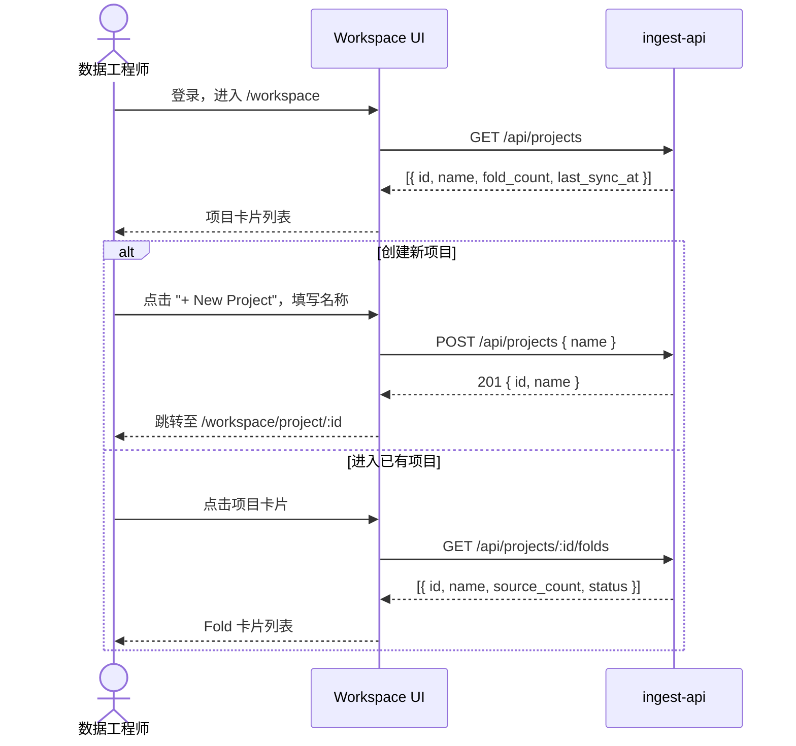
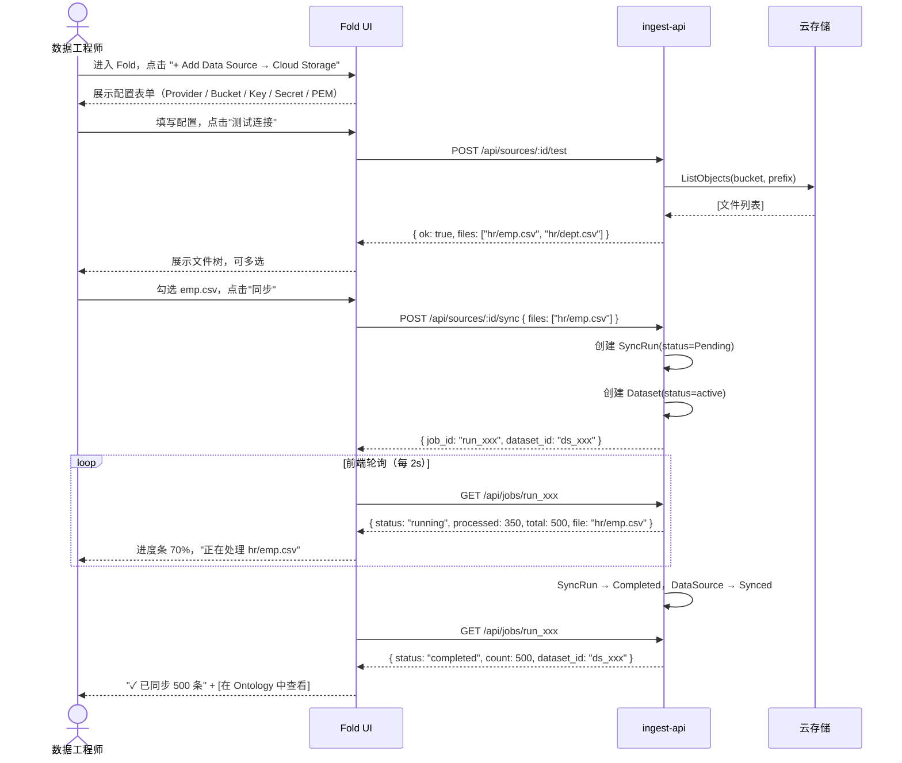
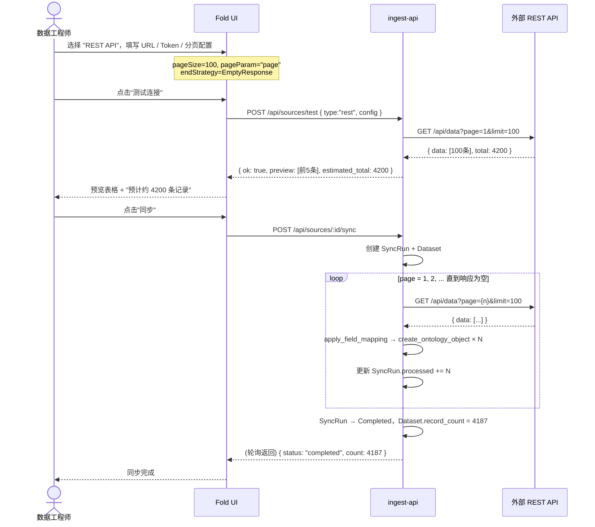
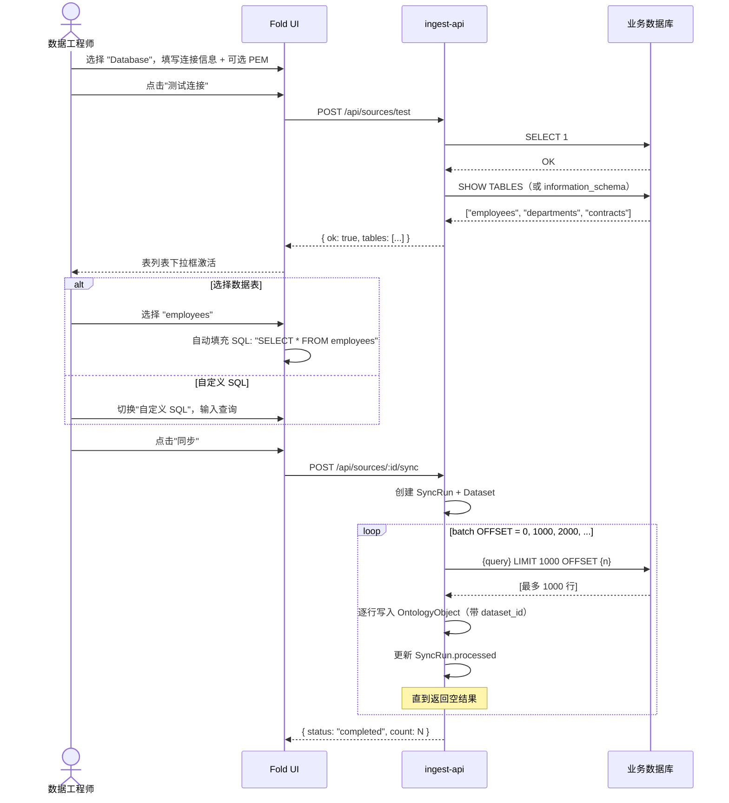

# 数据接入工作流设计 v0.2.0

> 版本：v0.2.0（在 v0.1.0 基础上引入薄 Dataset 层，增加状态机、API 规范、演进路线）
> 日期：2026-03-20
> 状态：已审阅，准备实现

---

## 变更记录

| 版本 | 日期 | 变更内容 |
|------|------|---------|
| v0.1.0 | 2026-03-19 | 初稿：US、领域模型、交互图、状态机 |
| v0.2.0 | 2026-03-20 | 引入薄 Dataset 层；补充 Palantir 对比分析；规范化 US；三阶段演进路线；API 契约 |

---

## 一、背景与目标

### 1.1 背景

平台需要将企业散落在各处的数据（云存储、数据库、REST API、FTP）统一接入 Ontology，
形成可供 Agent 查询和分析师使用的语义化数据集。

### 1.2 与 Palantir Foundry 的定位差异

Palantir Foundry 的完整接入链路为四层：

```
DataSource → Raw Dataset → Transform Pipeline → Curated Dataset → Ontology Object
```

每层独立演进、独立版本化，适合 500 人以上数据团队，代价是极高的复杂度。

**本平台的定位**：服务 10–50 人的数据团队，用**三层架构**覆盖 80% 场景：

```
DataSource（配置 + 同步）
  → Dataset（落地凭证：schema + 血缘，不存原始记录）
  → OntologyObject（语义层，带 dataset_id 追溯）
```

**核心取舍**：

| 能力 | Palantir | 本平台 Phase 1 | 本平台 Phase 2 |
|------|---------|--------------|--------------|
| 原始数据版本化 | ✅ 不可变快照 | ❌ | ✅ dataset_records |
| Pipeline 加工 | ✅ 可视化 DAG | ❌ | 部分支持 |
| 血缘追踪 | ✅ 完整 DAG | ✅ dataset_id | ✅ |
| 重跑 Materialize | ✅ 不重拉数据 | ⚠️ 需重拉 | ✅ |
| 同步原子性 | ✅ | ✅ SyncRun | ✅ |
| 多租户隔离 | ✅ | 暂缓 | ✅ |

---

## 二、用户故事（规范版）

> 格式：`作为 [角色]，当 [前置条件]，我想 [目标]，以便 [价值]。`
> 验收标准（AC）：可测试的具体行为。

---

### Epic E1：工作台与项目管理

**US-E1-01 查看项目列表**

```
作为 数据工程师，
当 我登录平台后，
我想 在工作台看到属于我的所有项目列表，
以便 快速定位当前工作上下文或决定是否新建项目。

验收标准：
  AC1: 列表按最近更新时间降序排列
  AC2: 每个项目卡片显示名称、Fold 数量、最近同步时间
  AC3: 项目列表为空时显示"创建第一个项目"引导
  AC4: 支持按名称搜索过滤
```

**US-E1-02 创建项目**

```
作为 数据工程师，
当 当前没有合适的项目或需要开启新的业务线，
我想 创建新项目并命名，
以便 将相关数据集和配置统一管理。

验收标准：
  AC1: 项目名称不能为空，最长 64 字符
  AC2: 同一用户下项目名称不重复
  AC3: 创建成功后自动进入该项目的 Fold 列表页
```

---

### Epic E2：业务域（Fold）管理

**US-E2-01 查看 Fold 列表**

```
作为 数据工程师，
当 进入某个项目后，
我想 看到该项目下所有业务域（Fold）的列表，
以便 选择进入已有业务域或决定是否新建。

验收标准：
  AC1: 每个 Fold 卡片显示名称、数据源数量、最近同步状态
  AC2: 状态以颜色标识（灰=未同步，绿=成功，黄=同步中，红=失败）
  AC3: 点击 Fold 卡片进入该 Fold 的数据源管理页
```

**US-E2-02 创建 Fold**

```
作为 数据工程师，
当 需要接入新业务线的数据时，
我想 在当前项目下创建新的 Fold，
以便 将该业务线的数据源和数据集统一组织。

验收标准：
  AC1: Fold 名称在同一项目内唯一
  AC2: 支持填写描述（可选）
  AC3: 创建后直接进入该 Fold 页面
```

---

### Epic E3：数据源配置

**US-E3-01 配置云存储数据源（S3 / OSS / COS / OBS）**

```
作为 数据工程师，
当 企业数据存储在云端对象存储中，
我想 配置云存储连接（AWS S3 / 阿里云 OSS / 腾讯云 COS / 华为 OBS / MinIO），
以便 将云上 CSV 文件同步到平台并生成 Ontology Dataset。

验收标准：
  AC1: 支持选择云服务商（自动填充默认 Endpoint）
  AC2: 必填：Bucket、Access Key、Secret Key
  AC3: 可选：自定义 Endpoint（私有化 / MinIO）、路径前缀（Prefix）
  AC4: 可选：上传或粘贴 SSL/PEM 证书（支持自签名证书场景）
  AC5: 点击"测试连接"成功后，展示 Bucket 内匹配的文件列表（树形结构）
  AC6: 支持多选文件（当前仅支持 CSV 格式，后续扩展 JSON / Parquet）
  AC7: 至少选择一个文件后，"同步"按钮才激活
  AC8: 同步完成后生成对应的 Dataset 并关联 EntityType
```

**US-E3-02 配置关系型数据库数据源**

```
作为 数据工程师，
当 业务数据存储在关系型数据库中，
我想 配置数据库连接（MySQL / PostgreSQL / SQL Server），
以便 将表数据同步到平台并生成 Ontology Dataset。

验收标准：
  AC1: 必填：数据库类型、Host、Port、数据库名、用户名、密码
  AC2: 可选：PEM/SSL 证书（用于 TLS 加密连接，如 AWS RDS SSL）
  AC3: 点击"测试连接"成功后，展示可用的数据表列表
  AC4: 用户可选择数据表（自动生成 SELECT *），或切换为自定义 SQL 输入框
  AC5: 自定义 SQL 支持语法高亮（简单实现）
  AC6: 同步时按批次拉取（LIMIT/OFFSET），避免大表一次性加载内存
  AC7: 同步进度实时更新（已处理行数 / 估算总行数）
```

**US-E3-03 配置 REST API 数据源**

```
作为 数据工程师，
当 业务数据通过 HTTP API 暴露，
我想 配置 REST API 连接，系统自动处理分页拉取，
以便 将 API 数据同步到平台并生成 Ontology Dataset。

验收标准：
  AC1: 必填：API 基础 URL
  AC2: 认证方式支持：无 / Bearer Token / API Key（自定义 Header）/ Basic Auth
  AC3: 分页配置：
    - 每页记录数（page_size）
    - 页码参数名（page_param，如 "page"）
    - 大小参数名（size_param，如 "limit"）
    - 起始页码（start_page，0 或 1）
    - 数据路径（records_path，如 "data.items"）
    - 结束判断：响应为空 / 响应记录数 < page_size / 响应携带总页数字段
  AC4: 点击"测试连接"拉取第一页，展示前 5 条预览和预估总量
  AC5: 同步时系统自动翻页直到数据耗尽，用户无需手动控制
  AC6: 单次 API 请求超时 30 秒，失败自动重试 3 次
```

**US-E3-04 配置 FTP / SFTP 数据源**

```
作为 数据工程师，
当 业务数据通过 FTP/SFTP 服务器传输，
我想 配置 FTP 连接并选择目标文件，
以便 将服务器上的文件同步到平台并生成 Ontology Dataset。

验收标准：
  AC1: 支持协议：FTP / FTPS（显式/隐式）/ SFTP
  AC2: 必填：Host、Port、用户名
  AC3: 认证：密码（FTP/FTPS）或 SSH 私钥 PEM（SFTP）
  AC4: 必填：远程目录路径；可选：文件过滤规则（如 *.csv）
  AC5: 点击"测试连接"成功后，展示匹配的文件列表和文件大小
  AC6: 支持多选文件
  AC7: 同步时逐文件下载 → 解析 → 写入，显示当前处理的文件名
```

---

### Epic E4：同步与数据集

**US-E4-01 触发同步**

```
作为 数据工程师，
当 数据源配置完成且测试连接通过，
我想 点击"同步"按钮启动数据拉取任务，
以便 将外部数据写入平台。

验收标准：
  AC1: 同步期间"同步"按钮变为"同步中..."并禁用，防止重复触发
  AC2: 系统创建 SyncRun 记录，状态为 Running
  AC3: 数据源状态更新为 Syncing
  AC4: 同步日志实时可查（最近 100 条）
```

**US-E4-02 查看同步进度**

```
作为 数据工程师，
当 同步任务进行中，
我想 看到实时进度（已处理 / 总量、耗时、当前处理文件/页码），
以便 判断任务是否正常推进。

验收标准：
  AC1: 进度条每 2 秒刷新一次（前端轮询）
  AC2: 显示：已写入条数 / 预估总条数 / 耗时
  AC3: 云存储/FTP 显示当前处理的文件名
  AC4: REST API 显示当前页码 / 预估总页数
  AC5: 同步完成后自动停止轮询，显示成功摘要
  AC6: 同步失败显示错误信息（网络超时 / 认证失败 / 数据格式错误）
```

**US-E4-03 查看 Dataset**

```
作为 数据工程师，
当 同步完成后，
我想 查看生成的 Dataset 信息（记录数、字段结构、来源），
并能直接跳转到关联的 Ontology Dataset，
以便 验证数据质量并交付给分析师。

验收标准：
  AC1: Dataset 展示：名称、来源数据源、同步时间、记录数、字段列表（含类型）
  AC2: 提供"在 Ontology 中查看"快捷入口
  AC3: 提供"重新同步"入口（创建新的 SyncRun）
  AC4: 历史同步记录列表（最近 10 次，含状态、时间、记录数）
```

---

## 三、领域模型

### 3.1 聚合层级

```
Workspace
└── Project（聚合根）
     ├── id: ProjectId
     ├── name: String
     └── folds: Vec<FoldId>

Fold（聚合根）
├── id: FoldId
├── project_id: ProjectId
├── name: String
├── description: Option<String>
└── data_sources: Vec<DataSourceId>

DataSource（聚合根）
├── id: DataSourceId
├── fold_id: FoldId
├── name: String
├── source_type: SourceType        # S3 | DB | REST | FTP
├── config: DataSourceConfig       # 值对象，按类型区分（敏感字段加密）
├── status: DataSourceStatus       # 状态机见 §4
├── last_sync_at: Option<DateTime>
└── record_count: Option<u64>

SyncRun（实体，DataSource 子实体）
├── id: SyncRunId
├── source_id: DataSourceId
├── status: SyncStatus             # 状态机见 §4
├── total_records: Option<u64>
├── processed: u64
├── error_message: Option<String>
├── started_at: DateTime
└── finished_at: Option<DateTime>

Dataset（实体，SyncRun 产出物）
├── id: DatasetId
├── source_id: DataSourceId
├── sync_run_id: SyncRunId
├── name: String
├── schema_json: String            # 推断的字段结构 JSON
├── record_count: u64
├── entity_type_id: Option<EntityTypeId>  # 关联的 Ontology EntityType
├── status: DatasetStatus          # active | archived
└── created_at: DateTime

OntologyObject（已有，新增血缘字段）
├── ... （原有字段）
├── dataset_id: Option<DatasetId>  # 来自哪个 Dataset（血缘）
└── sync_run_id: Option<SyncRunId> # 来自哪次同步
```

### 3.2 DataSourceConfig 值对象

```rust
enum DataSourceConfig {
    S3(S3Config),
    Database(DatabaseConfig),
    RestApi(RestApiConfig),
    Ftp(FtpConfig),
}

// 云存储
struct S3Config {
    provider:       CloudProvider,   // AwsS3 | AliyunOss | TencentCos | HuaweiObs | MinIO
    endpoint:       Option<String>,  // 自定义 Endpoint（私有化场景）
    bucket:         String,
    prefix:         Option<String>,  // 路径前缀过滤
    access_key:     String,
    secret_key:     Encrypted<String>,
    pem_cert:       Option<Encrypted<String>>,
    selected_files: Vec<String>,     // 用户选择的文件路径
}

// 关系型数据库
struct DatabaseConfig {
    db_type:   DbType,    // MySQL | PostgreSQL | SqlServer
    host:      String,
    port:      u16,
    database:  String,
    username:  String,
    password:  Encrypted<String>,
    pem_cert:  Option<Encrypted<String>>,
    query:     String,    // 表名或自定义 SQL
    batch_size: u32,      // 批次大小，默认 1000
}

// REST API
struct RestApiConfig {
    base_url:     String,
    auth:         AuthConfig,      // None | Bearer(token) | ApiKey(header,value) | Basic(user,pass)
    records_path: String,          // 响应体中数组的 JSON Path，如 "data.items"
    pagination:   PaginationConfig,
}

struct PaginationConfig {
    page_param:   String,          // URL 中页码参数名，如 "page"
    size_param:   String,          // URL 中每页大小参数名，如 "limit"
    page_size:    u32,             // 每页记录数
    start_page:   u32,             // 起始页码（0 或 1）
    // 结束判断（三选一）
    end_strategy: EndStrategy,     // EmptyResponse | LessThanPageSize | TotalPagesField(field_name)
}

// FTP / SFTP
struct FtpConfig {
    protocol:     FtpProtocol,     // Ftp | Ftps | Sftp
    host:         String,
    port:         u16,
    username:     String,
    password:     Option<Encrypted<String>>,
    pem_key:      Option<Encrypted<String>>,  // SSH 私钥（SFTP 场景）
    remote_path:  String,
    file_pattern: String,          // 如 "*.csv"
    selected_files: Vec<String>,
}
```

---

## 四、状态机

### 4.1 DataSource 状态机

```
                  ┌──────────────────────────────────────────────────────┐
                  │                                                      │
       创建        ▼       测试连接成功       触发同步                    │
     ────────► Idle ─────────────────► Connected ──────────► Syncing    │
                  │                       │                     │        │
                  │    测试连接失败        │                     │ 同步成功│
                  ▼                       │                     ▼        │
               Error ◄──────────────────-┘                  Synced ────┘
                  ▲                                              │
                  │                    同步失败                  │
                  └──────────────────────────────────────────────┘

       修改配置：任意状态 → Idle（重置，需重新测试）
```

| 状态 | 说明 | 允许操作 |
|------|------|---------|
| `Idle` | 已配置，未测试 | 编辑配置、测试连接 |
| `Connected` | 测试通过，可浏览 | 浏览文件/表、选择、同步 |
| `Syncing` | 同步进行中 | 查看进度（禁止重复同步）|
| `Synced` | 上次同步成功 | 重新同步、编辑配置 |
| `Error` | 测试失败或同步失败 | 查看错误、修改配置、重试 |

### 4.2 SyncRun 状态机

```
       创建           开始执行         全部完成
     ────────► Pending ────────► Running ────────► Completed
                                    │
                                    │ 发生错误
                                    ▼
                                 Failed
```

| 状态 | 说明 | 前端行为 |
|------|------|---------|
| `Pending` | 已创建，等待执行 | 进度条 0%，显示"等待中" |
| `Running` | 正在拉取 + 写入 | 进度条更新，每 2s 轮询 |
| `Completed` | 全部成功 | 停止轮询，显示成功摘要 |
| `Failed` | 不可恢复错误 | 停止轮询，显示错误详情 |

**轮询逻辑：**
```
状态 ∈ {Pending, Running} → 每 2s GET /api/jobs/:id → 更新 UI
状态 = Completed           → 停止轮询，展示"在 Ontology 中查看"
状态 = Failed              → 停止轮询，展示错误 + "重试"按钮
```

### 4.3 Dataset 状态

| 状态 | 说明 |
|------|------|
| `active` | 当前有效数据集，关联的 OntologyObject 正常可用 |
| `archived` | 已被新版本替代，OntologyObject 仍保留（可查历史）|

---

## 五、交互流程图

### Flow 1：Workspace 导航



---

### Flow 2：云存储数据源 — 配置 + 同步



---

### Flow 3：REST API 数据源 — 自动翻页同步



---

### Flow 4：数据库数据源 — 表选择 + 批量同步



---

## 六、API 契约

### 6.1 Fold 管理

```
GET    /api/projects/:id/folds
       Response: [{ id, name, description, source_count, status, created_at }]

POST   /api/projects/:id/folds
       Request:  { name: String, description?: String }
       Response: 201 { id, name, description, created_at }

DELETE /api/folds/:id
       Response: 204 No Content
```

### 6.2 DataSource 管理

```
GET    /api/folds/:id/sources
       Response: [{ id, name, source_type, status, last_sync_at, record_count }]

POST   /api/folds/:id/sources
       Request:  { name, source_type, config: DataSourceConfig }
       Response: 201 { id, name, source_type, status: "idle" }

PUT    /api/sources/:id
       Request:  { name?, config? }
       Response: 200 { id, status: "idle" }   # 修改配置后重置为 idle

DELETE /api/sources/:id
       Response: 204 No Content
```

### 6.3 测试连接

```
POST   /api/sources/:id/test
       Response（成功）: {
         ok: true,
         message: "Connected",
         // 按类型附加：
         files?:  ["path/to/file.csv"]          // S3 / FTP
         tables?: ["employees", "orders"]        // DB
         preview?: [{ ...record }]               // REST
         estimated_total?: 4200                  // REST
       }
       Response（失败）: {
         ok: false,
         error: "Connection timeout: 10.0.0.1:5432"
       }
```

### 6.4 同步

```
POST   /api/sources/:id/sync
       Request:  { files?: ["path/to/file.csv"] }  # 仅 S3/FTP 需要
       Response: 202 {
         job_id:     "run_uuid",
         dataset_id: "ds_uuid"
       }

GET    /api/jobs/:job_id
       Response: {
         id:         "run_uuid",
         status:     "running",           # pending|running|completed|failed
         processed:  350,
         total:      500,                 # null 表示未知
         current:    "hr/emp.csv",        # 当前文件/页码（可选）
         error:      null,
         elapsed_ms: 12400,
         dataset_id: "ds_uuid"
       }

GET    /api/sources/:id/jobs
       Response: [SyncRun列表，最近20次，降序]
```

### 6.5 Dataset 查询

```
GET    /api/sources/:id/datasets
       Response: [{ id, name, sync_run_id, record_count, entity_type_id, status, created_at }]

GET    /api/datasets/:id
       Response: {
         id, name, source_id, sync_run_id,
         schema: { fields: [{ name, inferred_type, nullable }] },
         record_count, entity_type_id, status, created_at
       }
```

---

## 七、数据库 Schema（Phase 1）

```sql
-- 业务域
CREATE TABLE IF NOT EXISTS folds (
    id          TEXT PRIMARY KEY,
    project_id  TEXT NOT NULL REFERENCES projects(id) ON DELETE CASCADE,
    name        TEXT NOT NULL,
    description TEXT,
    created_at  TEXT NOT NULL,
    UNIQUE(project_id, name)
);

-- 数据源配置
CREATE TABLE IF NOT EXISTS data_sources (
    id           TEXT PRIMARY KEY,
    fold_id      TEXT NOT NULL REFERENCES folds(id) ON DELETE CASCADE,
    name         TEXT NOT NULL,
    source_type  TEXT NOT NULL,   -- s3 | db | rest | ftp
    config       TEXT NOT NULL,   -- JSON（敏感字段 AES-256 加密，Phase 1 暂存明文）
    status       TEXT NOT NULL DEFAULT 'idle',
    last_sync_at TEXT,
    record_count INTEGER,
    created_at   TEXT NOT NULL
);

-- 同步执行记录
CREATE TABLE IF NOT EXISTS sync_runs (
    id            TEXT PRIMARY KEY,
    source_id     TEXT NOT NULL REFERENCES data_sources(id) ON DELETE CASCADE,
    status        TEXT NOT NULL DEFAULT 'pending',
    total_records INTEGER,
    processed     INTEGER NOT NULL DEFAULT 0,
    current_item  TEXT,           -- 当前处理的文件名或页码
    error_message TEXT,
    started_at    TEXT NOT NULL,
    finished_at   TEXT
);

-- Dataset 凭证（轻量，不存原始记录）
CREATE TABLE IF NOT EXISTS datasets (
    id             TEXT PRIMARY KEY,
    source_id      TEXT NOT NULL REFERENCES data_sources(id),
    sync_run_id    TEXT NOT NULL REFERENCES sync_runs(id),
    name           TEXT NOT NULL,
    schema_json    TEXT,
    record_count   INTEGER NOT NULL DEFAULT 0,
    entity_type_id TEXT REFERENCES entity_types(id),
    status         TEXT NOT NULL DEFAULT 'active',
    created_at     TEXT NOT NULL
);

-- OntologyObject 新增血缘列（幂等 migration）
ALTER TABLE ontology_objects ADD COLUMN dataset_id  TEXT REFERENCES datasets(id);
ALTER TABLE ontology_objects ADD COLUMN sync_run_id TEXT REFERENCES sync_runs(id);
```

---

## 八、三阶段演进路线

### Phase 1（当前实现目标）

**目标**：打通 DataSource → Dataset → OntologyObject 完整链路

```
实现范围：
  ✅ folds / data_sources / sync_runs / datasets DB 表
  ✅ API: Fold CRUD、DataSource CRUD、test、sync、job 查询
  ✅ UI: Workspace → Project → Fold → 数据源配置（4种）+ 同步进度
  ✅ 血缘：OntologyObject.dataset_id

暂缓：
  ❌ 敏感字段加密（明文存储，Phase 2 补）
  ❌ 云存储真实连接（存根，返回 mock 文件列表）
  ❌ FTP 真实连接（存根）
  ✅ REST API 和 DB 真实同步
```

### Phase 2（中期）

```
新增：
  ✅ dataset_records 表（原始记录缓存，支持 re-materialize）
  ✅ 敏感字段 AES-256 加密
  ✅ 云存储真实连接（object_store crate）
  ✅ FTP/SFTP 真实连接（ssh2 crate）
  ✅ SyncRun 进度实时推送（SSE 替代轮询）
```

### Phase 3（远期）

```
新增：
  ✅ Transform Pipeline（Dataset → Transform → Dataset DAG）
  ✅ 定时同步调度（cron）
  ✅ 增量同步（cursor-based，只拉新数据）
  ✅ 数据质量检查（空值率、类型一致性）
  ✅ 多 Dataset → 同一 EntityType（数据合并）
```

---

## 九、前端页面结构

```
/workspace
  └── 项目卡片列表（ProjectGrid）
       ├── 搜索过滤
       └── [+ New Project] 按钮

/workspace/project/:id
  └── Fold 卡片列表（FoldGrid）
       ├── 面包屑：Workspace > {ProjectName}
       └── [+ New Fold] 按钮

/workspace/fold/:id
  ├── 面包屑：Workspace > {ProjectName} > {FoldName}
  ├── 左侧面板：DataSource 列表（含状态指示灯）
  │    └── [+ Add Data Source] 按钮
  ├── 中部面板：DataSource 配置表单
  │    ├── Tab: ☁ Cloud Storage（S3/OSS/COS）
  │    ├── Tab: 🗄 Database（MySQL/PG/MSSQL）
  │    ├── Tab: 🌐 REST API
  │    └── Tab: 📁 FTP/SFTP
  │    └── [Test Connection] → [Browse Files/Tables] → [Sync]
  └── 右侧/底部面板：
       ├── 文件浏览器 / 数据预览表格
       ├── 同步进度条（轮询）
       └── Dataset 信息 + 历史 SyncRun 列表
```

---

*下一步：实现 Phase 1 DB migration + API + UI*
