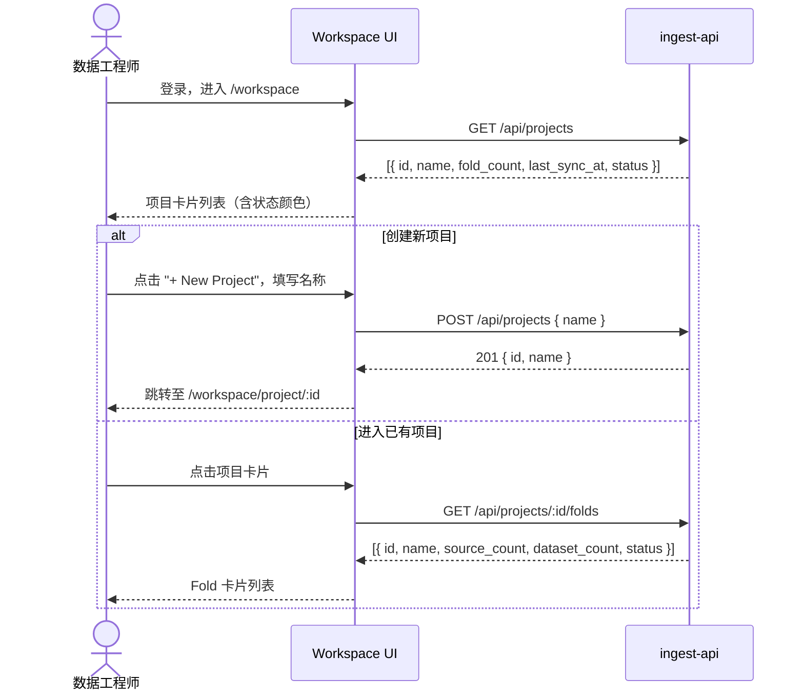
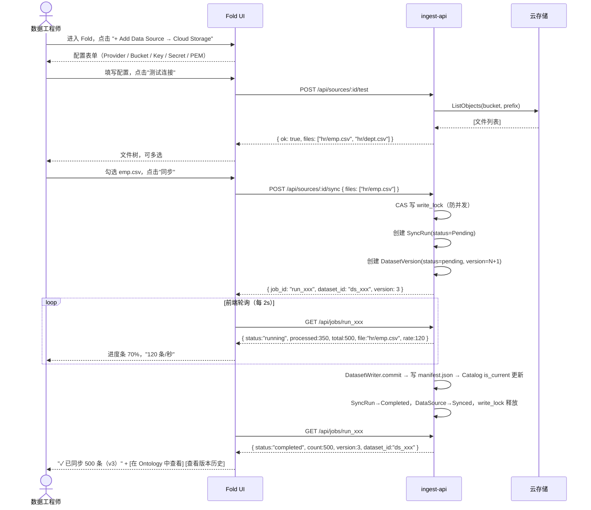
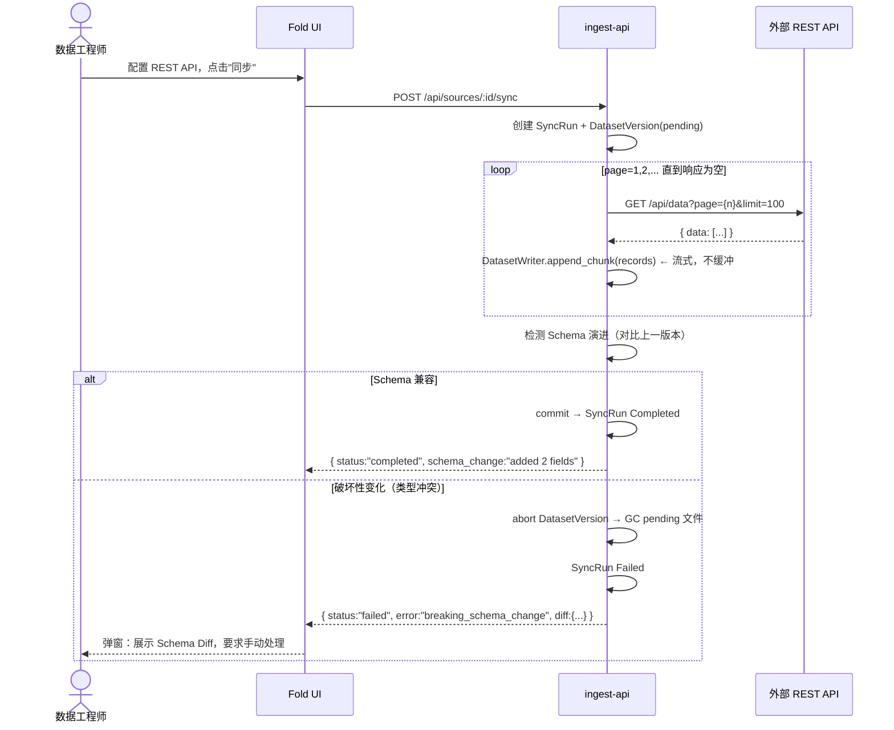
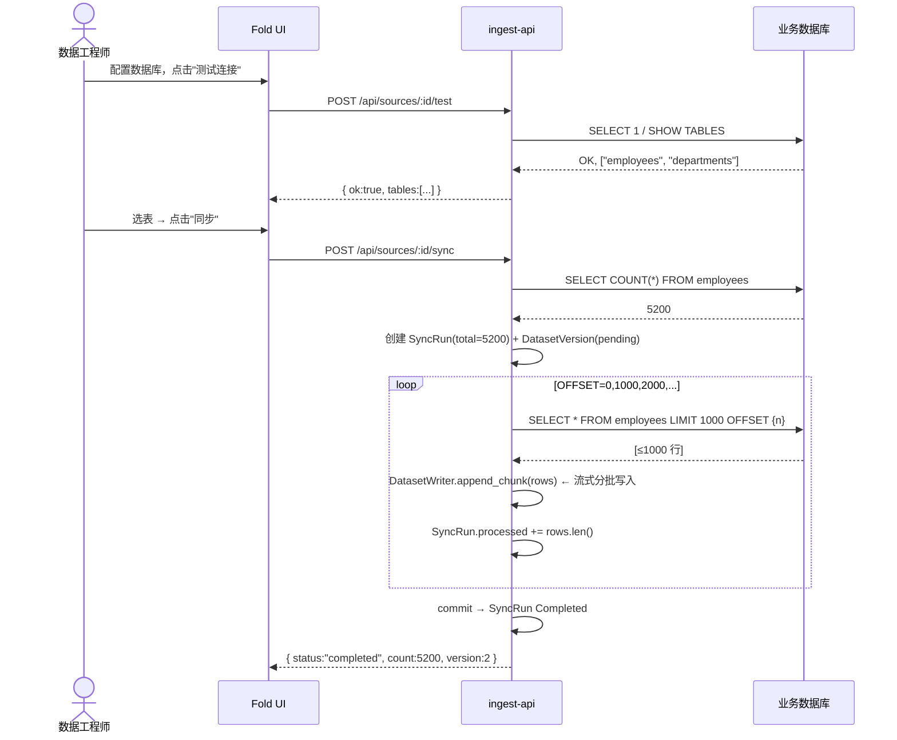
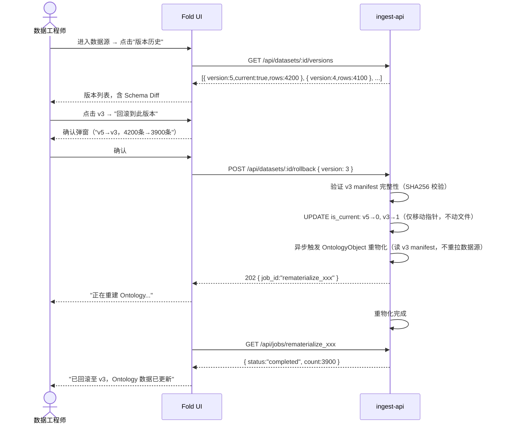

# 数据接入工作流设计 v0.3.0

> 版本：v0.3.0
> 日期：2026-03-20
> 状态：已审阅，准备实现
> 前置文档：[ingest-workflow v0.2.0](ingest-workflow_v0.2.0.md) · [ADR-34 Dataset 存储后端与版本化](../adr/ADR-34-dataset-storage-versioning.md)

---

## 变更记录

| 版本 | 日期 | 变更内容 |
|------|------|---------|
| v0.1.0 | 2026-03-19 | 初稿：US、领域模型、交互图、状态机 |
| v0.2.0 | 2026-03-20 | 引入薄 Dataset 层；Palantir 对比；规范化 US；三阶段演进；API 契约 |
| v0.3.0 | 2026-03-20 | 引入 StorageBackend 可插拔体系；补全六个设计盲点（写入原子性、崩溃恢复、Schema 演进、流式写入、多租户路径、并发冲突）；新增 Epic E5（Dataset 版本管理）；细化全部 US |

---

## 一、背景与目标

### 1.1 与 Palantir Foundry 的定位差异

Palantir Foundry 四层链路：

```
DataSource → Raw Dataset（版本化快照）→ Transform Pipeline → Curated Dataset → Ontology Object
```

**本平台三层架构（10–50 人数据团队）**：

```
DataSource（配置 + 同步）
  → Dataset（落地凭证：schema + 版本 manifest + 血缘）
  → OntologyObject（语义层，带 dataset_id 追溯）
```

### 1.2 v0.3.0 核心变化：StorageBackend 可插拔

v0.2.0 的 Dataset 仅在 SQLite 存元数据，不保留原始文件。v0.3.0 引入两层正交设计：

```
┌─────────────────────────────────────────┐
│  版本管理层 DatasetStore                 │  ← 感知版本，不感知存储细节
│  begin_write → stream_chunk → commit    │
│  rollback / expire_versions             │
├─────────────────────────────────────────┤
│  存储后端层 StorageBackend（可插拔 trait）│  ← 感知字节，不感知版本
│  put / get / list / delete              │
├──────────────┬──────────────┬───────────┤
│  LocalFs     │  S3/OSS/COS  │  RustFS   │
│  （Phase 1） │  （Phase 2） │ （Phase 2+）│
└──────────────┴──────────────┴───────────┘
```

**关键洞察**：
- RustFS 若兼容 S3 协议 → 直接复用 S3Backend（换 endpoint），无需单独实现
- 阿里云 OSS / 腾讯云 COS / MinIO / 华为 OBS 均走同一 S3Backend（`object_store` crate）
- 版本管理逻辑与存储后端完全解耦，切换后端不影响上层 API

### 1.3 能力对比

| 能力 | Palantir | Phase 1（当前）| Phase 2 | Phase 3 |
|------|---------|--------------|---------|---------|
| 原始数据版本化 | ✅ 不可变快照 | ❌ | ✅ Manifest + 文件 | ✅ |
| Pipeline 加工 | ✅ 可视化 DAG | ❌ | ❌ | ✅ 部分 |
| 血缘追踪 | ✅ 完整 DAG | ✅ dataset_id | ✅ parent_dataset_id | ✅ |
| 重跑 Materialize | ✅ 不重拉源 | ⚠️ 需重拉 | ✅ 读 Manifest | ✅ |
| 同步原子性 | ✅ | ✅ SyncRun 锁 | ✅ | ✅ |
| Schema 演进检测 | ✅ | ⚠️ 警告 | ✅ 自动分类 | ✅ |
| 版本回滚 | ✅ | ❌ | ✅ | ✅ |
| 多租户隔离 | ✅ | 暂缓 | ✅ 路径前缀 | ✅ |

---

## 二、用户故事（v0.3.0 规范版）

> 格式：`作为 [角色]，当 [前置条件]，我想 [目标]，以便 [价值]。`
> 验收标准（AC）：可测试的具体行为。

---

### Epic E1：工作台与项目管理

**US-E1-01 查看项目列表**

```
作为 数据工程师，
当 我登录平台后，
我想 在工作台看到属于我的所有项目列表，
以便 快速定位当前工作上下文或决定是否新建项目。

验收标准：
  AC1: 列表按最近更新时间降序排列
  AC2: 每个项目卡片显示名称、Fold 数量、最近同步时间、整体同步状态
  AC3: 项目列表为空时显示"创建第一个项目"引导，附示例图
  AC4: 支持按名称实时搜索过滤（前端过滤，无需请求后端）
  AC5: 卡片状态颜色：灰=无同步记录，绿=全部成功，黄=部分同步中，红=存在失败
```

**US-E1-02 创建项目**

```
作为 数据工程师，
当 当前没有合适的项目或需要开启新的业务线，
我想 创建新项目并命名，
以便 将相关数据集和配置统一管理。

验收标准：
  AC1: 项目名称不能为空，最长 64 字符，仅允许中英文、数字、连字符、下划线
  AC2: 同一用户下项目名称不重复（后端校验，实时提示）
  AC3: 创建成功后自动跳转至该项目的 Fold 列表页
  AC4: 创建失败（名称重复）时表单内联提示，不关闭弹窗
```

---

### Epic E2：业务域（Fold）管理

**US-E2-01 查看 Fold 列表**

```
作为 数据工程师，
当 进入某个项目后，
我想 看到该项目下所有业务域（Fold）的列表，
以便 选择进入已有业务域或决定是否新建。

验收标准：
  AC1: 面包屑显示：Workspace > {ProjectName}
  AC2: 每个 Fold 卡片显示：名称、数据源数量、Dataset 数量、最近同步时间、整体状态
  AC3: 状态颜色：灰=未同步，绿=全部成功，黄=同步中，红=存在失败
  AC4: 点击 Fold 卡片进入该 Fold 的数据源管理页
  AC5: 支持按名称过滤
```

**US-E2-02 创建 Fold**

```
作为 数据工程师，
当 需要接入新业务线的数据时，
我想 在当前项目下创建新的 Fold，
以便 将该业务线的数据源和数据集统一组织。

验收标准：
  AC1: Fold 名称在同一项目内唯一，最长 64 字符
  AC2: 支持填写描述（可选，最长 256 字符）
  AC3: 创建后直接进入该 Fold 页面，面包屑同步更新
  AC4: 创建失败时内联提示，不关闭弹窗
```

---

### Epic E3：数据源配置

**US-E3-01 配置云存储数据源（S3 / OSS / COS / OBS / MinIO）**

```
作为 数据工程师，
当 企业数据存储在云端对象存储中，
我想 配置云存储连接，
以便 将云上文件同步到平台并生成 Ontology Dataset。

验收标准：
  AC1: 支持云服务商选择：AWS S3 / 阿里云 OSS / 腾讯云 COS / 华为 OBS / MinIO（自定义 Endpoint）
  AC2: 选择云服务商后自动填充默认 Endpoint；MinIO 要求手动填写
  AC3: 必填：Bucket、Access Key、Secret Key
  AC4: 可选：路径前缀（Prefix）、SSL/PEM 证书（支持文件上传或粘贴文本）
  AC5: 点击"测试连接"：成功展示文件树（按路径前缀过滤），失败展示错误详情
  AC6: 支持多选文件（当前仅支持 .csv，后续扩展 .json / .parquet）
  AC7: 至少选择一个文件后，"同步"按钮才激活
  AC8: 同步完成后生成对应 Dataset，并提示关联 EntityType
  AC9: 连接配置保存前，Secret Key 字段在界面上脱敏显示（****）
```

**US-E3-02 配置关系型数据库数据源**

```
作为 数据工程师，
当 业务数据存储在关系型数据库中，
我想 配置数据库连接，
以便 将表数据同步到平台并生成 Ontology Dataset。

验收标准：
  AC1: 支持数据库类型：MySQL / PostgreSQL / SQL Server
  AC2: 必填：数据库类型、Host、Port、数据库名、用户名、密码
  AC3: 可选：PEM/SSL 证书（用于 TLS 加密连接）
  AC4: 点击"测试连接"成功后，展示可用数据表列表（下拉框 + 搜索）
  AC5: 选择表后自动生成 `SELECT * FROM {table}`；支持切换为"自定义 SQL"输入框
  AC6: 自定义 SQL 输入框提供基本语法提示（关键字高亮）
  AC7: 同步时按批次拉取（默认 LIMIT 1000 OFFSET n），避免大表一次性加载
  AC8: 同步进度实时展示：已处理行数 / 预估总行数（COUNT(*) 预查询）
  AC9: 系统检测 SQL 是否已含 LIMIT 子句，如有则不再追加，避免语法错误
```

**US-E3-03 配置 REST API 数据源**

```
作为 数据工程师，
当 业务数据通过 HTTP API 暴露，
我想 配置 REST API 连接，系统自动处理分页拉取，
以便 将 API 数据同步到平台并生成 Ontology Dataset。

验收标准：
  AC1: 必填：API 基础 URL
  AC2: 认证方式：无 / Bearer Token / API Key（自定义 Header 名 + 值）/ Basic Auth
  AC3: 分页配置（可选，默认拉取单页不分页）：
       - 每页记录数（page_size）
       - 页码参数名（page_param，如 "page"）
       - 大小参数名（size_param，如 "limit"）
       - 起始页码（start_page，0 或 1）
       - 数据路径（records_path，如 "data.items"；留空时自动检测响应中第一个数组字段）
       - 结束判断：响应为空 / 记录数 < page_size / 响应携带总页数字段（指定字段名）
  AC4: 点击"测试连接"拉取第一页，展示前 5 条记录预览 + 预估总量
  AC5: 同步时系统自动翻页直到数据耗尽，用户无需手动控制
  AC6: 单次 API 请求超时 30 秒，失败自动重试 3 次（指数退避），达上限后标记失败
  AC7: 支持响应体为 Array（直接解析）或 Object（自动找第一个 Array 字段）
```

**US-E3-04 配置 FTP / SFTP 数据源**

```
作为 数据工程师，
当 业务数据通过 FTP/SFTP 服务器传输，
我想 配置 FTP 连接并选择目标文件，
以便 将服务器上的文件同步到平台并生成 Ontology Dataset。

验收标准：
  AC1: 支持协议：FTP / FTPS（显式/隐式）/ SFTP
  AC2: 必填：Host、Port、用户名
  AC3: 认证：密码（FTP/FTPS）或 SSH 私钥 PEM 文件（SFTP）
  AC4: 必填：远程目录路径；可选：文件过滤规则（如 *.csv，支持 glob 语法）
  AC5: 测试连接成功后展示匹配文件列表（名称 + 大小 + 修改时间）
  AC6: 支持多选文件；显示已选文件总大小估算
  AC7: 同步时逐文件下载 → 解析 → 写入，进度显示当前处理文件名和百分比
  AC8: 单文件下载超时 60 秒；断开自动重连 3 次
```

---

### Epic E4：同步执行

**US-E4-01 触发同步**

```
作为 数据工程师，
当 数据源配置完成且测试连接通过，
我想 点击"同步"按钮启动数据拉取任务，
以便 将外部数据写入平台并生成新版本 Dataset。

验收标准：
  AC1: 同步期间"同步"按钮变为"同步中..."并禁用，防止重复触发
  AC2: 同一数据源同一时刻只允许一个 SyncRun 执行（后端互斥锁）；
       若已有进行中的任务，提示"当前已有同步任务在执行，请等待完成后再触发"
  AC3: 系统创建 SyncRun 记录（status=Pending），并为 Dataset 分配新版本号
  AC4: Dataset 版本写入状态初始为 pending，commit 后变为 committed
  AC5: DataSource 状态更新为 Syncing
  AC6: 同步日志实时可查（最近 100 条，含时间戳 + 级别）
```

**US-E4-02 查看同步进度**

```
作为 数据工程师，
当 同步任务进行中，
我想 看到实时进度（已处理 / 总量、耗时、当前处理对象），
以便 判断任务是否正常推进，及早发现异常。

验收标准：
  AC1: 进度条每 2 秒刷新一次（前端轮询 GET /api/jobs/:id）
  AC2: 显示字段：已写入条数 / 预估总条数（-1 表示未知）/ 耗时 / 数据写入速率（条/秒）
  AC3: 云存储/FTP：显示当前处理的文件名 + 文件内进度百分比
  AC4: REST API：显示当前页码 / 预估总页数
  AC5: 数据库：显示当前 OFFSET / 预估总行数
  AC6: 同步完成后自动停止轮询，显示成功摘要（总条数、耗时、版本号）
  AC7: 同步失败显示错误详情（错误类型 / 发生位置 / 建议操作）
  AC8: 提供"取消同步"按钮（仅 Running 状态可用），取消后清理 pending 版本文件
```

**US-E4-03 同步失败处理**

```
作为 数据工程师，
当 同步任务因网络/认证/格式错误而失败，
我想 看到清晰的错误说明，并能在修复后重试，
以便 不丢失已配置的数据源设置。

验收标准：
  AC1: 错误信息分类展示：网络错误 / 认证失败 / 数据格式错误 / 存储写入失败
  AC2: 提供"查看完整日志"链接（展示 SyncRun 的 error_message + 执行日志）
  AC3: DataSource 状态回退为 Error（非 Synced）
  AC4: 失败的 SyncRun 的 pending 版本文件在后台自动清理（GC）
  AC5: 提供"重试"按钮，直接用相同配置启动新的 SyncRun，无需重新填写表单
  AC6: 系统记录失败原因到 sync_runs.error_message，支持后续审计查看
```

---

### Epic E5：Dataset 版本管理

**US-E5-01 查看 Dataset 历史版本**

```
作为 数据工程师，
当 某个数据源已完成多次同步，
我想 查看该数据源的所有 Dataset 历史版本列表，
以便 了解数据变化趋势并决定是否需要回滚。

验收标准：
  AC1: 版本列表按版本号降序排列，显示：版本号、同步时间、记录数、文件大小（Phase 2）、状态
  AC2: 当前生效版本以"当前"标签高亮标识
  AC3: 每个版本展示 Schema 快照（字段名 + 类型），可展开查看
  AC4: Phase 1（thin Dataset）：不展示文件列表；Phase 2：展示每个版本的文件列表
  AC5: 展示版本与上一版本的 Schema Diff（字段新增/删除/类型变化）
  AC6: 历史版本关联的 SyncRun 可点击跳转查看详细日志
```

**US-E5-02 回滚到历史版本**

```
作为 数据工程师，
当 最新同步引入了错误数据或 Schema 破坏性变化，
我想 将 Dataset 回滚到某个历史版本，
以便 恢复 Ontology 中的数据到可信状态，而无需重新拉取源数据。

验收标准：
  AC1: 只有 Phase 2（存储 Manifest 的版本）支持回滚；Phase 1 版本只能"重新同步"
  AC2: 点击"回滚到此版本"后，弹窗确认（显示：将从 v5 回滚到 v3，Ontology 中 XXX 条记录将被替换）
  AC3: 回滚操作只移动 Catalog 中的 current_version 指针，不删除任何文件（秒级完成）
  AC4: 回滚后系统异步触发 OntologyObject 重物化（基于目标版本 Manifest，不重拉数据源）
  AC5: 回滚期间 DataSource 状态为 Syncing；完成后恢复 Synced
  AC6: 回滚操作记录到审计日志（谁在什么时间从 v5 回滚到 v3）
  AC7: 回滚失败（目标版本文件损坏）时展示错误，当前版本不变
```

**US-E5-03 Schema 演进冲突处理**

```
作为 数据工程师，
当 数据源的字段结构在新同步中发生变化，
我想 系统自动检测变化类型并给予明确提示，
以便 我决定是否继续同步或手动处理兼容性问题。

验收标准：
  AC1: 系统在 commit 前自动与上一版本 Schema 对比，生成兼容性报告
  AC2: 变化分三类：
       - 向后兼容（新增字段，有默认值）：自动通过，在成功摘要中提示"新增 N 个字段"
       - 向前兼容（删除字段）：弹窗警告（"字段 X 已从源端消失，Ontology 中该字段将置空"），
         用户确认后继续
       - 破坏性变化（字段类型变化，如 string→integer）：阻止同步，显示详细说明，
         要求用户手动处理（删除旧 EntityType 字段或类型转换）
  AC3: Schema Diff 在弹窗中以表格形式展示（字段名 / 原类型 / 新类型 / 影响范围）
  AC4: 用户可选择"强制同步（忽略兼容性警告）"，风险由用户承担（操作记录到审计日志）
  AC5: 每次版本 Manifest 存储 schema_change 字段，记录与上一版本的 Diff
```

**US-E5-04 版本保留策略配置**

```
作为 数据工程师，
当 数据源频繁同步导致历史版本文件占用大量存储，
我想 为该数据源配置版本保留策略，
以便 自动清理过期版本，控制存储成本。

验收标准：
  AC1: 保留策略支持两种维度（可组合）：
       - 最近 N 个版本（默认 10）
       - 最近 N 天内的版本
  AC2: 策略仅在 Phase 2（有实际文件）时生效；Phase 1 无文件不受影响
  AC3: 当前生效版本（is_current=1）永不被清理，无论策略如何配置
  AC4: 清理操作异步执行，不阻塞用户操作；执行结果记录（清理了哪些版本、释放多少空间）
  AC5: 策略变更后下次同步触发时自动执行一次清理
```

---

## 三、领域模型（v0.3.0）

### 3.1 聚合层级

```
Workspace
└── Project（聚合根）
     ├── id: ProjectId
     ├── name: String
     └── folds: Vec<FoldId>

Fold（聚合根）
├── id: FoldId
├── project_id: ProjectId
├── name: String
├── description: Option<String>
└── data_sources: Vec<DataSourceId>

DataSource（聚合根）
├── id: DataSourceId
├── fold_id: FoldId
├── name: String
├── source_type: SourceType          # S3 | DB | REST | FTP
├── config: DataSourceConfig         # 值对象（敏感字段加密）
├── status: DataSourceStatus         # 状态机见 §4
├── write_lock: Option<SyncRunId>    # 并发写保护（非空=有同步在执行）
├── last_sync_at: Option<DateTime>
└── record_count: Option<u64>

SyncRun（实体，DataSource 子实体）
├── id: SyncRunId
├── source_id: DataSourceId
├── status: SyncStatus               # 状态机见 §4
├── total_records: Option<u64>
├── processed: u64
├── current_item: Option<String>     # 当前文件名/页码
├── bytes_written: u64               # Phase 2：实际写入字节数
├── error_message: Option<String>
├── started_at: DateTime
└── finished_at: Option<DateTime>

Dataset（聚合根，版本化单元）
├── id: DatasetId
├── source_id: DataSourceId
├── name: String
├── entity_type_id: Option<EntityTypeId>
├── current_version: u32             # 当前生效版本号
├── retention_policy: RetentionPolicy
└── created_at: DateTime

DatasetVersion（实体，Dataset 子实体）
├── id: DatasetVersionId
├── dataset_id: DatasetId
├── version: u32                     # 单调递增
├── sync_run_id: SyncRunId
├── status: DatasetVersionStatus     # pending | committed | aborted
├── manifest_path: Option<String>    # Phase 2：对象存储路径
├── schema: DatasetSchema            # 字段结构快照
├── schema_change: SchemaChange      # 与上一版本的 Diff
├── total_rows: u64
├── total_bytes: u64                 # Phase 2
├── content_hash: String             # SHA256(所有文件哈希)，用于 dedup
└── created_at: DateTime

OntologyObject（已有，新增血缘字段）
├── ... （原有字段）
├── dataset_id: Option<DatasetId>
└── sync_run_id: Option<SyncRunId>
```

### 3.2 值对象

**DataSourceConfig**

```rust
enum DataSourceConfig {
    S3(S3Config),
    Database(DatabaseConfig),
    RestApi(RestApiConfig),
    Ftp(FtpConfig),
}

struct S3Config {
    provider:       CloudProvider,   // AwsS3 | AliyunOss | TencentCos | HuaweiObs | MinIO
    endpoint:       Option<String>,
    bucket:         String,
    prefix:         Option<String>,
    access_key:     String,
    secret_key:     Encrypted<String>,
    pem_cert:       Option<Encrypted<String>>,
    selected_files: Vec<String>,
}

struct DatabaseConfig {
    db_type:    DbType,    // MySQL | PostgreSQL | SqlServer
    host:       String,
    port:       u16,
    database:   String,
    username:   String,
    password:   Encrypted<String>,
    pem_cert:   Option<Encrypted<String>>,
    query:      String,    // 表名或自定义 SQL
    batch_size: u32,       // 默认 1000
}

struct RestApiConfig {
    base_url:     String,
    auth:         AuthConfig,      // None | Bearer | ApiKey | Basic
    records_path: Option<String>,  // 留空时自动检测
    pagination:   Option<PaginationConfig>,
}

struct PaginationConfig {
    page_param:   String,
    size_param:   String,
    page_size:    u32,
    start_page:   u32,
    end_strategy: EndStrategy,     // EmptyResponse | LessThanPageSize | TotalPagesField(field)
}

struct FtpConfig {
    protocol:       FtpProtocol,   // Ftp | Ftps | Sftp
    host:           String,
    port:           u16,
    username:       String,
    password:       Option<Encrypted<String>>,
    pem_key:        Option<Encrypted<String>>,
    remote_path:    String,
    file_pattern:   String,
    selected_files: Vec<String>,
}
```

**RetentionPolicy**

```rust
struct RetentionPolicy {
    keep_versions: Option<u32>,  // 保留最近 N 个版本，默认 10
    keep_days:     Option<u32>,  // 保留 N 天内的版本
    // 两者取并集；当前版本永远不清理
}
```

**SchemaChange（版本 Diff）**

```rust
struct SchemaChange {
    added:   Vec<SchemaField>,            // 新增字段
    removed: Vec<SchemaField>,            // 删除字段
    changed: Vec<(SchemaField, SchemaField)>, // (旧, 新) 类型变化
    compatibility: SchemaCompatibility,
}

enum SchemaCompatibility {
    Compatible,             // 无变化
    BackwardCompatible,     // 只新增字段（有默认值）
    ForwardCompatible,      // 只删除字段
    Breaking,               // 类型变化等破坏性改动
}
```

### 3.3 基础设施：StorageBackend（可插拔 trait）

```rust
/// 纯存储层，不感知版本概念
trait StorageBackend: Send + Sync {
    async fn put(&self, path: &str, data: Bytes) -> Result<()>;
    async fn get(&self, path: &str) -> Result<Bytes>;
    async fn exists(&self, path: &str) -> Result<bool>;
    async fn list(&self, prefix: &str) -> Result<Vec<String>>;
    async fn delete(&self, path: &str) -> Result<()>;
    async fn delete_prefix(&self, prefix: &str) -> Result<u64>;
    fn capabilities(&self) -> BackendCapabilities;  // presigned_url / atomic_rename 等
}

/// 路径约定：{tenant_id}/{dataset_id}/v{n}/{data,manifest}/...
/// 多租户路径隔离通过前缀实现，S3 IAM Policy 可按 /{tenant_id}/* 授权

struct LocalFsBackend  { root: PathBuf }   // Phase 1，零依赖
struct S3Backend       { store: Arc<dyn ObjectStore>, prefix: String }  // Phase 2
struct RustFsBackend   { client: RustFsClient, bucket: String }          // Phase 2+
```

**DatasetStore（版本管理层）**

```rust
struct DatasetStore {
    backend: Arc<dyn StorageBackend>,
    catalog: Arc<Db>,
}

impl DatasetStore {
    async fn begin_write(&self, dataset_id, sync_run_id) -> Result<DatasetWriter>;
    async fn commit(&self, writer: DatasetWriter, schema: DatasetSchema) -> Result<DatasetVersion>;
    async fn abort(&self, writer: DatasetWriter) -> Result<()>;  // 清理 pending 文件
    async fn current_version(&self, dataset_id) -> Result<DatasetManifest>;
    async fn get_version(&self, dataset_id, version: u32) -> Result<DatasetManifest>;
    async fn list_versions(&self, dataset_id) -> Result<Vec<DatasetVersionMeta>>;
    async fn rollback(&self, dataset_id, version: u32) -> Result<()>;
    async fn expire_versions(&self, dataset_id, policy: &RetentionPolicy) -> Result<u64>;
}

/// DatasetWriter 流式写入（不缓冲全量数据）
struct DatasetWriter {
    // 每次 append_chunk 调用追加数据到当前 part 文件
    // 单个 part 超过 part_size_limit（默认 128MB）时自动滚动新文件
    async fn append_chunk(&mut self, records: &[Record]) -> Result<()>;
}
```

---

## 四、状态机

### 4.1 DataSource 状态机

```
                 ┌──────────────────────────────────────────────────────┐
                 │                                                      │
      创建        ▼       测试连接成功       触发同步                    │
    ────────► Idle ─────────────────► Connected ──────────► Syncing    │
                 │                       │                     │        │
                 │    测试连接失败        │                     │ 同步成功│
                 ▼                       │                     ▼        │
              Error ◄───────────────────┘                  Synced ────┘
                 ▲                                              │
                 │                    同步失败                  │
                 └──────────────────────────────────────────────┘

      修改配置：任意状态 → Idle（重置，需重新测试）
      并发保护：Syncing 状态拒绝新同步请求（write_lock 非空）
```

| 状态 | 说明 | 允许操作 |
|------|------|---------|
| `Idle` | 已配置，未测试 | 编辑配置、测试连接 |
| `Connected` | 测试通过，可浏览 | 浏览文件/表、选择、同步 |
| `Syncing` | 同步进行中（write_lock 持有者） | 查看进度、取消（禁止重复同步）|
| `Synced` | 上次同步成功 | 重新同步、编辑配置、查看版本历史 |
| `Error` | 测试失败或同步失败 | 查看错误、修改配置、重试 |

### 4.2 SyncRun 状态机

```
      创建           开始执行         全部完成
    ────────► Pending ────────► Running ────────► Completed
                                   │
                                   ├── 发生错误 ──────► Failed
                                   │
                                   └── 用户取消 ──────► Cancelled
```

| 状态 | 说明 | 前端行为 | 后续动作 |
|------|------|---------|---------|
| `Pending` | 已创建，等待执行 | 进度条 0%，"等待中" | — |
| `Running` | 正在拉取 + 写入 | 进度条更新，每 2s 轮询 | — |
| `Completed` | 全部成功 | 停止轮询，显示成功摘要 | commit DatasetVersion |
| `Failed` | 不可恢复错误 | 停止轮询，显示错误 + 重试 | abort DatasetVersion → GC |
| `Cancelled` | 用户主动取消 | 停止轮询，显示"已取消" | abort DatasetVersion → GC |

### 4.3 DatasetVersion 状态机（新增）

```
      begin_write       commit（写 Manifest + 更新 Catalog）
    ─────────────► pending ──────────────────────────────► committed（is_current=1）
                      │
                      ├── abort（用户取消 / 同步失败）────► aborted
                      │        └── 触发后台 GC 删除对应目录下所有文件
                      │
                      └── 进程崩溃（超过 TTL 未 commit）── aborted（启动扫描修复）
```

| 状态 | 说明 |
|------|------|
| `pending` | 正在写入，文件未完整 |
| `committed` | 文件完整，Manifest 已写，Catalog 已索引 |
| `aborted` | 写入中止，后台 GC 负责清理对应目录 |

**崩溃恢复机制**：
```
服务启动时扫描 dataset_versions WHERE status='pending' AND created_at < NOW()-15min
→ 对每条记录：backend.delete_prefix(path) → UPDATE status='aborted'
→ 释放对应 DataSource.write_lock
```

---

## 五、交互流程图

### Flow 1：Workspace 导航



### Flow 2：云存储数据源 — 配置 + 同步



### Flow 3：REST API 数据源 — 自动翻页 + Schema 演进检测



### Flow 4：数据库数据源 — 批量同步



### Flow 5：Dataset 版本回滚



---

## 六、API 契约（v0.3.0）

### 6.1 Fold 管理

```
GET    /api/projects/:id/folds
       Response: [{ id, name, description, source_count, dataset_count, status, created_at }]

POST   /api/projects/:id/folds
       Request:  { name: String, description?: String }
       Response: 201 { id, name, description, created_at }

DELETE /api/folds/:id
       Response: 204
```

### 6.2 DataSource 管理

```
GET    /api/folds/:id/sources
       Response: [{ id, name, source_type, status, last_sync_at, record_count, write_lock }]

POST   /api/folds/:id/sources
       Request:  { name, source_type, config: DataSourceConfig }
       Response: 201 { id, name, source_type, status:"idle" }

PUT    /api/sources/:id
       Request:  { name?, config? }
       Response: 200 { id, status:"idle" }   # 修改配置后重置为 idle

DELETE /api/sources/:id
       Response: 204
```

### 6.3 测试连接

```
POST   /api/sources/:id/test
       Response（成功）: {
         ok: true,
         files?:           ["path/to/file.csv"],          // S3 / FTP
         tables?:          ["employees", "orders"],        // DB
         preview?:         [{ ...record }],               // REST
         estimated_total?: 4200,                          // REST
         schema?:          { fields: [...] }              // 推断 schema
       }
       Response（失败）: { ok: false, error: "描述", error_type: "timeout|auth|format" }
```

### 6.4 同步与进度

```
POST   /api/sources/:id/sync
       Request:  { files?: ["path/to/file.csv"] }   # 仅 S3/FTP 需要
       Response: 202 { job_id, dataset_id, version }
       Error（已有同步在执行）: 409 { error: "sync_in_progress", current_job_id }

GET    /api/jobs/:job_id
       Response: {
         id, status,         # pending|running|completed|failed|cancelled
         processed,
         total,              # null=未知
         current,            # 当前文件/页码
         rate,               # 条/秒
         error, error_type,
         elapsed_ms,
         dataset_id, version
       }

POST   /api/jobs/:job_id/cancel
       Response: 202         # 异步取消，GC 后台执行

GET    /api/sources/:id/jobs
       Response: [SyncRun列表，最近20次，降序]
```

### 6.5 Dataset 与版本管理

```
GET    /api/sources/:id/datasets
       Response: [{ id, name, current_version, record_count, entity_type_id, created_at }]

GET    /api/datasets/:id
       Response: { id, name, source_id, current_version, schema, record_count, entity_type_id, ... }

GET    /api/datasets/:id/versions
       Response: [{
         version, status,          # committed|aborted
         sync_run_id, is_current,
         total_rows, total_bytes,  # Phase 2
         schema_change: {          # 与上一版本 diff
           added:[], removed:[], changed:[], compatibility
         },
         created_at
       }]

POST   /api/datasets/:id/rollback
       Request:  { version: u32 }
       Response: 202 { job_id }    # 异步重物化

GET    /api/datasets/:id/versions/:v/schema
       Response: { fields: [{ name, data_type, nullable }] }

PUT    /api/datasets/:id/retention
       Request:  { keep_versions?: u32, keep_days?: u32 }
       Response: 200
```

---

## 七、数据库 Schema（Phase 1，含 v0.3.0 新增）

```sql
-- 业务域
CREATE TABLE IF NOT EXISTS folds (
    id          TEXT PRIMARY KEY,
    project_id  TEXT NOT NULL REFERENCES projects(id) ON DELETE CASCADE,
    name        TEXT NOT NULL,
    description TEXT,
    created_at  TEXT NOT NULL,
    UNIQUE(project_id, name)
);

-- 数据源配置
CREATE TABLE IF NOT EXISTS data_sources (
    id            TEXT PRIMARY KEY,
    fold_id       TEXT NOT NULL REFERENCES folds(id) ON DELETE CASCADE,
    name          TEXT NOT NULL,
    source_type   TEXT NOT NULL,   -- s3 | db | rest | ftp
    config        TEXT NOT NULL,   -- JSON（Phase 2 加密敏感字段）
    status        TEXT NOT NULL DEFAULT 'idle',
    write_lock    TEXT,            -- 正在执行的 sync_run_id（并发保护）
    last_sync_at  TEXT,
    record_count  INTEGER,
    created_at    TEXT NOT NULL
);

-- 同步执行记录
CREATE TABLE IF NOT EXISTS sync_runs (
    id            TEXT PRIMARY KEY,
    source_id     TEXT NOT NULL REFERENCES data_sources(id) ON DELETE CASCADE,
    status        TEXT NOT NULL DEFAULT 'pending',  -- pending|running|completed|failed|cancelled
    total_records INTEGER,
    processed     INTEGER NOT NULL DEFAULT 0,
    current_item  TEXT,
    bytes_written INTEGER NOT NULL DEFAULT 0,
    error_message TEXT,
    error_type    TEXT,            -- timeout|auth|format|storage|schema_breaking
    started_at    TEXT NOT NULL,
    finished_at   TEXT
);

-- Dataset（版本容器，每次同步产出一个新版本）
CREATE TABLE IF NOT EXISTS datasets (
    id              TEXT PRIMARY KEY,
    source_id       TEXT NOT NULL REFERENCES data_sources(id),
    name            TEXT NOT NULL,
    entity_type_id  TEXT REFERENCES entity_types(id),
    current_version INTEGER NOT NULL DEFAULT 0,
    created_at      TEXT NOT NULL
);

-- DatasetVersion（每次 SyncRun 产出一个版本）
CREATE TABLE IF NOT EXISTS dataset_versions (
    id              TEXT PRIMARY KEY,
    dataset_id      TEXT NOT NULL REFERENCES datasets(id) ON DELETE CASCADE,
    version         INTEGER NOT NULL,
    sync_run_id     TEXT NOT NULL REFERENCES sync_runs(id),
    status          TEXT NOT NULL DEFAULT 'pending',  -- pending|committed|aborted
    manifest_path   TEXT,          -- Phase 2：对象存储路径
    schema_json     TEXT NOT NULL DEFAULT '{}',
    schema_change   TEXT,          -- JSON: {added,removed,changed,compatibility}
    total_rows      INTEGER NOT NULL DEFAULT 0,
    total_bytes     INTEGER NOT NULL DEFAULT 0,
    content_hash    TEXT NOT NULL DEFAULT '',
    is_current      INTEGER NOT NULL DEFAULT 0,
    created_at      TEXT NOT NULL,
    UNIQUE(dataset_id, version)
);

CREATE INDEX idx_dataset_versions_current ON dataset_versions(dataset_id, is_current);

-- 版本保留策略
CREATE TABLE IF NOT EXISTS dataset_retention_policies (
    dataset_id      TEXT PRIMARY KEY REFERENCES datasets(id) ON DELETE CASCADE,
    keep_versions   INTEGER,       -- 保留最近 N 个版本
    keep_days       INTEGER,       -- 或保留 N 天内的版本
    updated_at      TEXT NOT NULL
);

-- OntologyObject 血缘字段（幂等 migration）
-- ALTER TABLE ontology_objects ADD COLUMN dataset_id  TEXT REFERENCES datasets(id);
-- ALTER TABLE ontology_objects ADD COLUMN sync_run_id TEXT REFERENCES sync_runs(id);
```

---

## 八、三阶段演进路线（v0.3.0 更新）

### Phase 1（当前实现目标）

**目标**：打通 DataSource → DatasetVersion → OntologyObject 完整链路

```
实现范围：
  ✅ folds / data_sources / sync_runs / datasets / dataset_versions DB 表
  ✅ API: Fold CRUD、DataSource CRUD、test、sync、job 查询、版本列表
  ✅ UI: Workspace → Project → Fold → 数据源配置（4种）+ 同步进度 + 版本列表
  ✅ 血缘：OntologyObject.dataset_id
  ✅ 并发写保护（write_lock 字段）
  ✅ Schema 演进检测（基于上一版本 schema_json 对比）
  ✅ 崩溃恢复（启动时扫描 pending 版本，TTL=15min 后 abort）
  ✅ StorageBackend trait + LocalFsBackend（文件存储占坑，Phase 1 不写实际文件）

暂缓：
  ❌ 敏感字段加密（明文存储，Phase 2 补）
  ❌ 云存储真实连接（S3Backend，mock 文件列表）
  ❌ FTP 真实连接（stub）
  ❌ Manifest 文件写入（LocalFsBackend 有接口无实际写入）
  ❌ 版本回滚（无 Manifest 无法重物化）
  ✅ REST API 和 DB 真实同步（DatasetWriter 流式追加到 OntologyObject）
```

### Phase 2（中期，有实际存储需求时）

```
新增：
  ✅ LocalFsBackend 真实文件写入（DatasetWriter.append_chunk → part-xxx.csv）
  ✅ Manifest 写入 + SHA256 dedup
  ✅ 版本回滚（移动 is_current 指针 + 异步重物化）
  ✅ 版本保留策略 + GC job
  ✅ S3Backend（object_store crate，覆盖 AWS S3/OSS/COS/MinIO/OBS）
  ✅ 敏感字段 AES-256 加密
  ✅ SyncRun 进度 SSE 推送（替代轮询）
  ✅ FTP/SFTP 真实连接（ssh2 crate）
  ✅ 多租户路径前缀隔离（{tenant_id}/{dataset_id}/v{n}/）
```

### Phase 3（远期）

```
新增：
  ✅ Transform Pipeline（DatasetVersion → Transform → DatasetVersion DAG）
  ✅ parent_dataset_id 血缘（衍生 Dataset 追溯）
  ✅ 定时同步调度（cron，ADR-11）
  ✅ 增量同步（cursor-based，只拉新数据）
  ✅ RustFsBackend（若 RustFS 提供原生 Rust API）
  ✅ Parquet 输出格式（DataFusion 直查，ADR-18）
  ✅ 数据质量检查（空值率、类型一致性）
  ✅ 多 DatasetVersion → 同一 EntityType（数据合并）
  ✅ 存储配额管理（total_bytes 汇总 + 告警）
```

---

## 九、前端页面结构（v0.3.0 更新）

```
/workspace
  └── 项目卡片列表（ProjectGrid）
       ├── 搜索过滤（前端）
       ├── 状态颜色汇总
       └── [+ New Project] 按钮

/workspace/project/:id
  └── Fold 卡片列表（FoldGrid）
       ├── 面包屑：Workspace > {ProjectName}
       └── [+ New Fold] 按钮

/workspace/fold/:id
  ├── 面包屑：Workspace > {ProjectName} > {FoldName}
  ├── 左侧面板：DataSource 列表（含状态指示灯）
  │    └── [+ Add Data Source] 按钮
  ├── 中部面板：DataSource 配置表单
  │    ├── Tab: ☁ Cloud Storage（S3/OSS/COS）
  │    ├── Tab: 🗄 Database（MySQL/PG/MSSQL）
  │    ├── Tab: 🌐 REST API
  │    └── Tab: 📁 FTP/SFTP
  │         └── [Test Connection] → [Browse Files/Tables] → [Sync]
  └── 右侧/底部面板：
       ├── 文件浏览器 / 数据预览表格
       ├── 同步进度条（轮询 → Phase 2 升级为 SSE）
       │    ├── 进度百分比 + 写入速率（条/秒）
       │    └── [取消同步] 按钮（Running 状态）
       ├── Schema 演进冲突弹窗（破坏性变化时阻断）
       └── Dataset 面板：
            ├── 当前版本信息（记录数、字段列表）
            ├── [在 Ontology 中查看] 按钮
            └── 版本历史标签页
                 ├── 版本列表（版本号、时间、记录数、Schema Diff）
                 ├── [回滚到此版本] 按钮（Phase 2，仅 committed 版本）
                 └── 版本保留策略配置
```

---

## 十、设计盲点备忘（已全部纳入本文档）

| 盲点 | 解决方案 | 体现位置 |
|------|---------|---------|
| 写入原子性 / 崩溃恢复 | DatasetVersion.status=pending + 启动扫描 GC | §3.1 + §4.3 |
| `put()` 非原子（半写文件） | LocalFs 用 temp-then-rename；S3 put 天然原子 | ADR-34 |
| Schema 演进兼容性检测 | SchemaChange 值对象 + 三分类处理 | §3.2 + US-E5-03 |
| DatasetWriter 流式写入 | `append_chunk` 不缓冲全量，part 文件自动滚动 | §3.3 |
| 多租户路径隔离 | `{tenant_id}/{dataset_id}/v{n}/` 前缀 | §3.3 + Phase 2 |
| 并发写冲突 | write_lock CAS + 409 错误 | §4.1 + US-E4-01 AC2 |

---

*下一步：Phase 1 实现 — DB migration → API handlers → Workspace UI*
