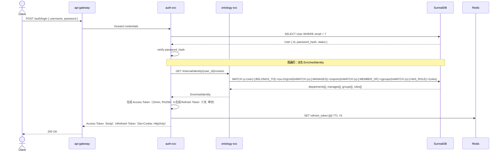
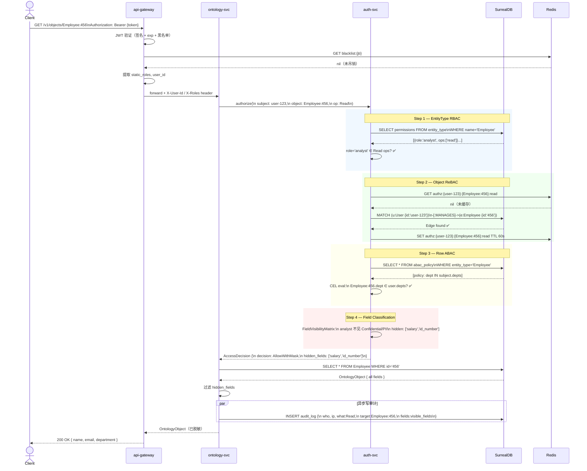
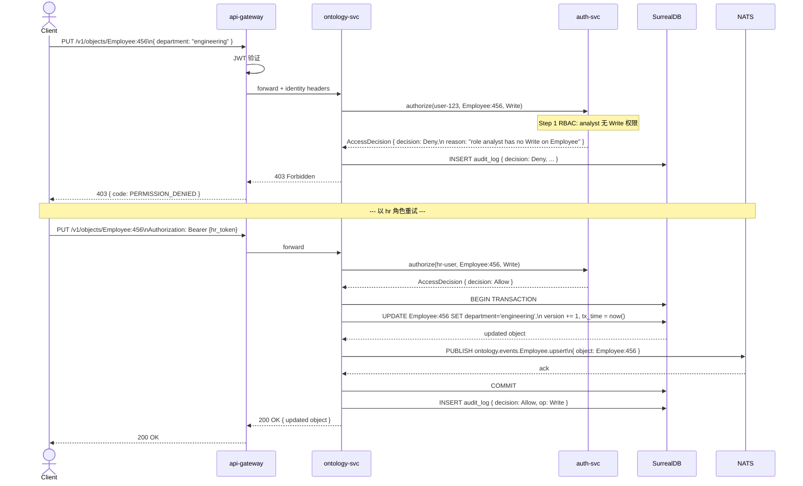
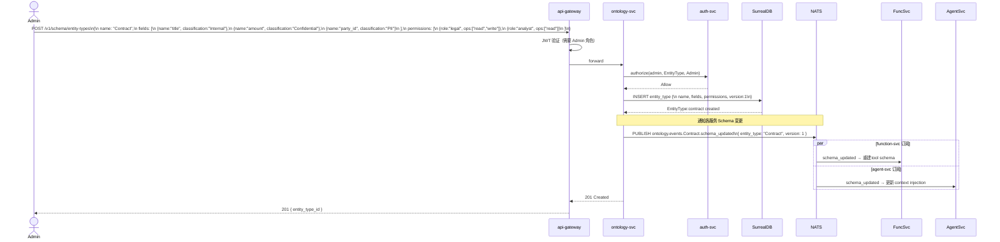
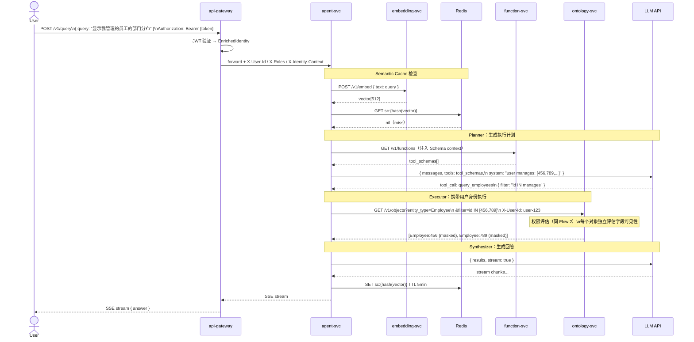

# Ontology 身份与权限 — 交互流程图

> 版本：v0.1.0 | 日期：2026-03-19 | 关联：ADR-26、domain/ontology-permission-domain_v0.1.0.md

---

## Flow 1：用户登录与身份增强

> JWT 颁发 + 从 Ontology 图派生 EnrichedIdentity

---

## Flow 2：对象读取（四粒度权限评估）

> 核心流程，逐层短路评估

---

## Flow 3：对象写入（含权限 + 事件发布）

---

## Flow 4：TBox Schema 定义（含权限配置）

> 管理员定义 EntityType，附带字段分类和角色权限

---

## Flow 5：Agent 查询（身份感知 + 权限透传）

> Agent 查询时携带用户身份，权限评估在 ontology-svc 发生

---

## 版本历史

| 版本 | 日期 | 变更内容 |
|------|------|---------|
| v0.1.0 | 2026-03-19 | 初始版本：5 个核心交互流程 |
