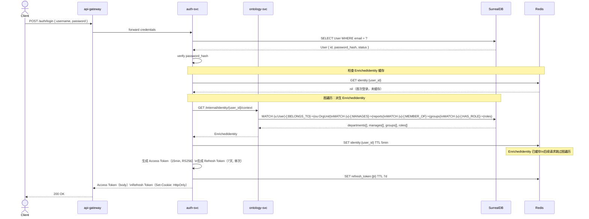
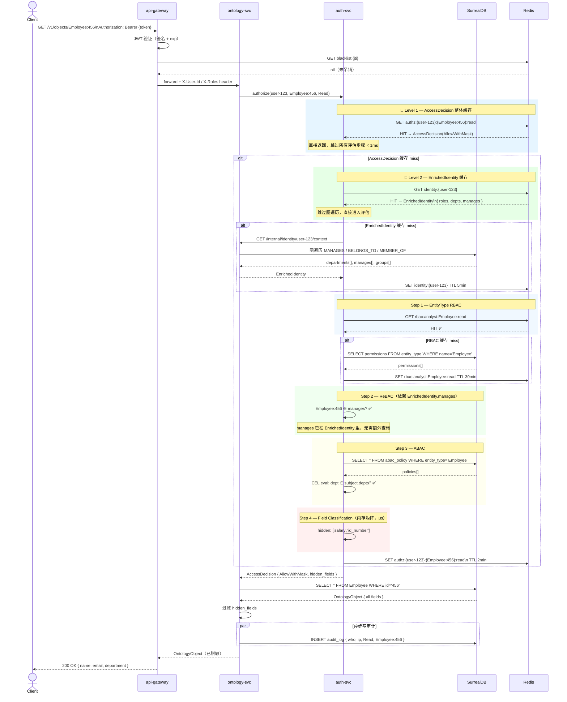
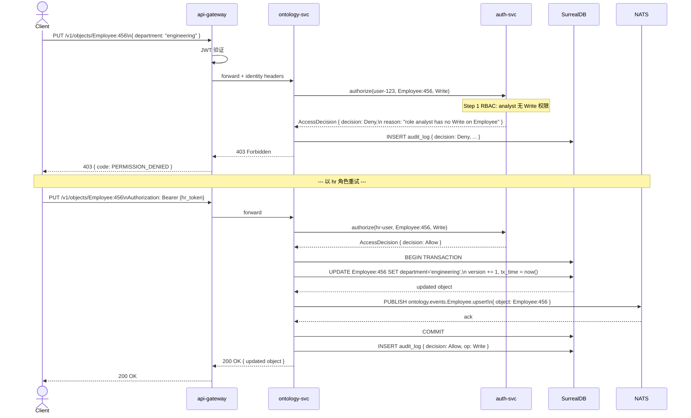
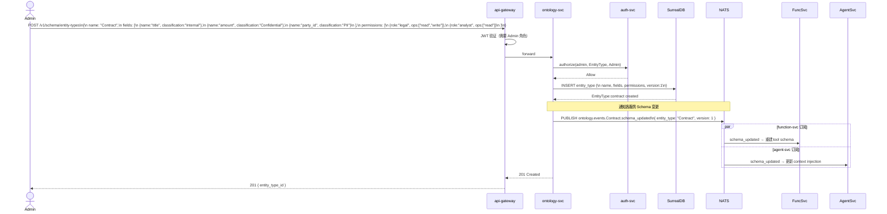
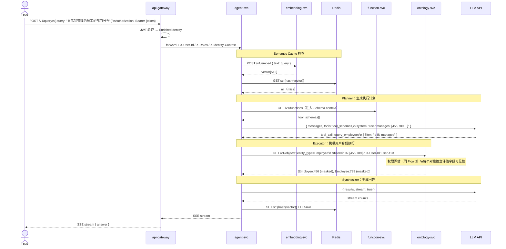
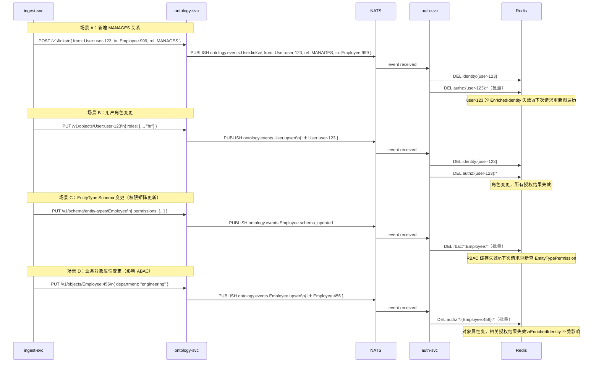

# Ontology 身份与权限 — 交互流程图

> 版本：v0.1.1 | 日期：2026-03-19 | 关联：ADR-26、domain/ontology-permission-domain_v0.1.0.md

---

## Flow 1：用户登录与身份增强

> JWT 颁发 + 从 Ontology 图派生 EnrichedIdentity + 写入缓存

---

## Flow 2：对象读取（三级缓存 + 四粒度权限评估）

> 优先命中缓存短路，miss 时逐层评估

---

## Flow 3：对象写入（含权限 + 事件发布）

---

## Flow 4：TBox Schema 定义（含权限配置）

> 管理员定义 EntityType，附带字段分类和角色权限

---

## Flow 5：Agent 查询（身份感知 + 权限透传）

> Agent 查询时携带用户身份，权限评估在 ontology-svc 发生

---

## Flow 6：缓存失效（事件驱动）

> OntologyEvent 触发对应缓存清除，保证一致性

---

## 版本历史

| 版本 | 日期 | 变更内容 |
|------|------|---------|
| v0.1.0 | 2026-03-19 | 初始版本：5 个核心交互流程 |
| v0.1.1 | 2026-03-19 | Flow 1 加入 EnrichedIdentity 缓存写入；Flow 2 升级为三级缓存短路评估；新增 Flow 6 事件驱动缓存失效 |
