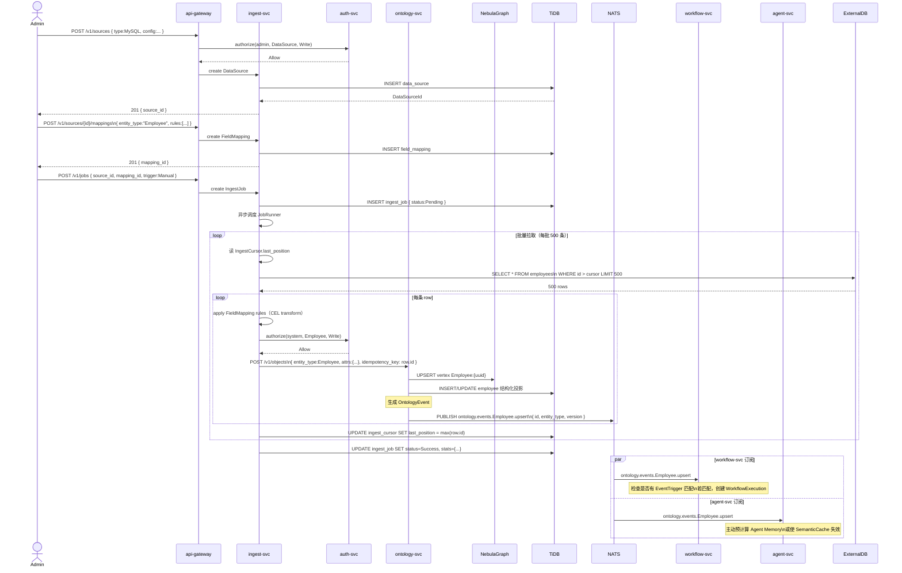
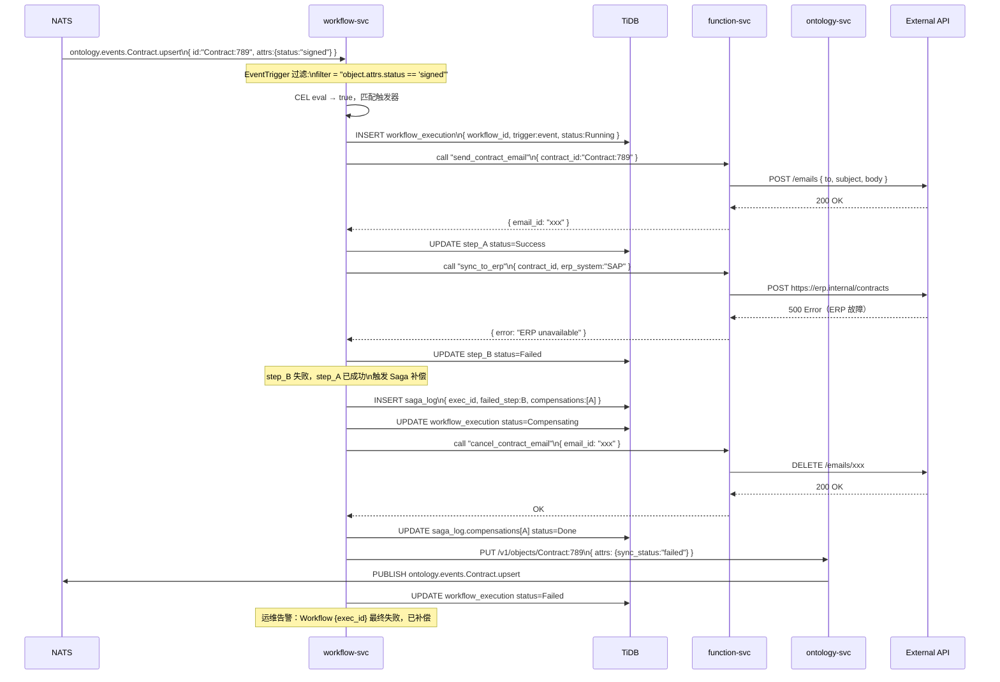
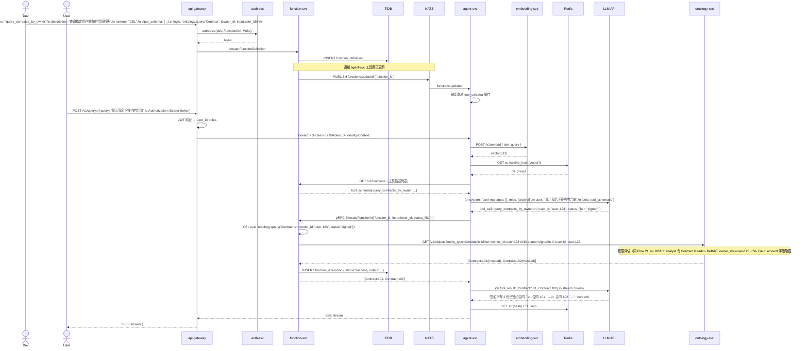
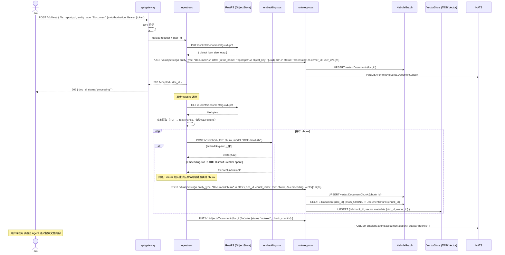

# Palantir — 用户 Story、领域模型与交互流程图

> 版本：v0.1.0 | 日期：2026-03-19
> 关联：ADR-26、ontology-permission-domain_v0.1.0.md、ontology-permission-interactions_v0.1.1.md

---

## 一、用户 Story 清单（全局细化）

> 格式：`US-XX | As [角色] | I want [目标] | So that [价值]`
> 优先级：P0 = MVP 必须；P1 = 第一版可选；P2 = 后续迭代

### Epic 1：数据摄入（ingest-svc）

| ID | 角色 | 目标 | 价值 | 优先级 |
|----|------|------|------|--------|
| US-01 | 数据管理员 | 注册外部数据源（MySQL / CSV / REST API / Kafka） | 把各系统数据统一摄入 Ontology | P0 |
| US-02 | 数据管理员 | 配置字段映射（源字段 → EntityType.field） | 原始数据规范化为 OntologyObject | P0 |
| US-03 | 数据管理员 | 触发一次性摄入任务，查看摄入进度 | 手动导入历史数据 | P0 |
| US-04 | 系统 | 摄入失败后从上次游标续传，不重复写入 | 保证数据幂等性，避免重复 | P0 |
| US-05 | 数据管理员 | 配置定时摄入（Cron），持续同步增量数据 | 外部数据自动保持最新 | P1 |
| US-06 | 数据管理员 | 查看摄入历史（成功/失败/跳过条数） | 问题排查与审计 | P1 |

### Epic 2：Ontology 管理（ontology-svc）

| ID | 角色 | 目标 | 价值 | 优先级 |
|----|------|------|------|--------|
| US-10 | 管理员 | 定义 EntityType（Schema = TBox），设置字段名/类型/分类 | 为数据建立结构契约 | P0 |
| US-11 | 管理员 | 更新 EntityType Schema，发布版本 | Schema 随业务演进 | P0 |
| US-12 | 用户 / 系统 | 创建 OntologyObject（ABox 实例） | 写入结构化业务数据 | P0 |
| US-13 | 用户 / 系统 | 查询 OntologyObject（单条 / 批量 / 过滤） | 读取业务数据 | P0 |
| US-14 | 用户 / 系统 | 建立两个 OntologyObject 之间的关系（Link） | 构建图结构，支持 ReBAC 和图遍历 | P0 |
| US-15 | 系统 | 删除过期数据（按 RetentionPolicy），WORM 归档 | 满足合规保留要求（ADR-09） | P1 |
| US-16 | 用户 | 离线编辑 OntologyObject，联网后自动合并（CRDT） | 弱网场景使用（ADR-05） | P2 |

### Epic 3：身份认证（auth-svc）

| ID | 角色 | 目标 | 价值 | 优先级 |
|----|------|------|------|--------|
| US-20 | 用户 | 用用户名/密码或 OAuth 登录，获取 Access Token | 身份识别 | P0 |
| US-21 | 用户 | Access Token 过期时，用 Refresh Token 静默续期 | 体验无感知 | P0 |
| US-22 | 用户 | 登出，吊销 Refresh Token | 安全退出 | P0 |
| US-23 | 管理员 | 创建/更新/删除用户账号 | 人员变更管理 | P0 |
| US-24 | 管理员 | 将用户加入角色 / 组织单元 / 用户组 | 权限批量管理 | P0 |

### Epic 4：权限控制（auth-svc + ontology-svc）

| ID | 角色 | 目标 | 价值 | 优先级 |
|----|------|------|------|--------|
| US-30 | 管理员 | 为 EntityType 配置角色权限（RBAC）：哪些角色可读/写/删/管理 | 类型级访问控制 | P0 |
| US-31 | 用户 | 读取我直接管理（MANAGES）的对象，即使没有全局角色 | 上级查看下属数据 | P0 |
| US-32 | 管理员 | 定义行级策略（ABAC）：CEL 表达式过滤哪些对象可见 | 精细化行级控制 | P1 |
| US-33 | 管理员 | 为字段设置分类（Public/Internal/Confidential/PII） | 字段级可见性控制 | P1 |
| US-34 | 系统 | 权限变更（角色/关系/Schema）后，缓存自动失效 | 权限收紧立即生效 | P0 |
| US-35 | 合规 | 所有数据访问都有审计记录（谁、何时、读了什么） | 合规与溯源 | P0 |

### Epic 5：Agent 智能查询（agent-svc）

| ID | 角色 | 目标 | 价值 | 优先级 |
|----|------|------|------|--------|
| US-40 | 用户 | 用自然语言提问，Agent 自动查询 Ontology 并回答 | 无需学习查询语法 | P0 |
| US-41 | 用户 | 回答以流式（SSE）方式逐字输出，无需等待全部完成 | 长查询体验优化 | P0 |
| US-42 | 系统 | 语义相似的查询命中语义缓存，不重复调用 LLM | 降低 LLM 费用 | P1 |
| US-43 | 用户 | Agent 返回结果严格遵守用户权限，无法越权看到数据 | 权限透传，数据安全 | P0 |
| US-44 | 用户 | 多轮对话：后续问题可引用上下文 | 连贯交互 | P1 |
| US-45 | 管理员 | 查看 Agent 执行轨迹（工具调用链 / Token 消耗） | 问题排查与成本审计 | P1 |

### Epic 6：Function 执行（function-svc）

| ID | 角色 | 目标 | 价值 | 优先级 |
|----|------|------|------|--------|
| US-50 | 开发者 | 注册 Rust / CEL / 自然语言函数，供 Agent 和 Workflow 调用 | 逻辑复用与低代码扩展 | P0 |
| US-51 | 系统 | Agent 选择工具后，同步调用 Function 并得到结果 | Agent 工具执行 | P0 |
| US-52 | 开发者 | 配置外部 API 集成（HTTP outbound），由 function-svc 统一出站 | 集中管控外部依赖 | P1 |
| US-53 | 开发者 | 查看 Function 执行历史（输入/输出/耗时/错误） | 调试与监控 | P1 |

### Epic 7：Workflow 编排（workflow-svc）

| ID | 角色 | 目标 | 价值 | 优先级 |
|----|------|------|------|--------|
| US-60 | 管理员 | 定义 Workflow（有序步骤列表，每步调用 Function） | 业务流程自动化 | P0 |
| US-61 | 管理员 | 配置 Cron 触发器，定时执行 Workflow | 定时任务 | P1 |
| US-62 | 管理员 | 配置事件触发器，OntologyEvent 满足条件时自动执行 | 事件驱动自动化 | P1 |
| US-63 | 系统 | Workflow 某步骤失败时，按 Saga 模式执行补偿操作 | 分布式事务一致性 | P1 |
| US-64 | 操作员 | 查看正在执行的 Workflow 列表、状态、已用时长 | 运维监控 | P1 |
| US-65 | 操作员 | 手动终止卡住的 Workflow 实例 | 运维干预 | P1 |

### Epic 8：文件与向量化（embedding-svc + RustFS）

| ID | 角色 | 目标 | 价值 | 优先级 |
|----|------|------|------|--------|
| US-70 | 用户 | 上传文件，系统自动分片、向量化，建立语义索引 | 文件内容可被语义搜索 | P1 |
| US-71 | 系统 | 文本 Embedding 请求统一路由到 embedding-svc | 向量化能力集中复用 | P0 |
| US-72 | 系统 | embedding-svc 不可用时，agent-svc 降级跳过语义缓存 | 单点故障不影响核心查询 | P1 |

---

## 二、领域模型（从 Story 提取）

> 已有模型见 [ontology-permission-domain_v0.1.0.md](ontology-permission-domain_v0.1.0.md)。
> 本节补充 Ingest / Agent / Function / Workflow 四个限界上下文。

### 2.1 聚合边界总图

```
┌─────────────────┐   ┌───────────────────┐   ┌─────────────────────┐
│  Identity 聚合   │   │  Ontology 聚合     │   │  Permission 聚合     │
│                 │   │                   │   │                     │
│  User           │   │  EntityType (TBox)│   │  EntityTypePermission│
│  Role           │   │  FieldDefinition  │   │  RelationshipRule    │
│  Group          │   │  OntologyObject   │   │  AbacPolicy          │
│  OrgUnit        │   │  OntologyRel.     │   │  AccessDecision      │
│  EnrichedIdent. │   │                   │   │  AuditLog            │
└────────┬────────┘   └────────┬──────────┘   └──────────┬──────────┘
         │                    │                          │
         └────────────────────┴──────────────────────────┘
                              │  OntologyEvent（事件骨干）
         ┌────────────────────┼──────────────────────────┐
         ▼                    ▼                          ▼
┌─────────────────┐  ┌────────────────────┐  ┌──────────────────────┐
│  Ingest 聚合    │  │  Agent 聚合         │  │  Workflow 聚合        │
│                 │  │                   │  │                      │
│  DataSource     │  │  AgentSession     │  │  WorkflowDefinition  │
│  FieldMapping   │  │  AgentMessage     │  │  WorkflowStep        │
│  IngestJob      │  │  AgentMemory      │  │  WorkflowTrigger     │
│  IngestCursor   │  │  AgentTrace       │  │  WorkflowExecution   │
│  IngestRecord   │  │  SemanticCache    │  │  SagaLog             │
└─────────────────┘  └────────────────────┘  └──────────────────────┘
                              │
                     ┌────────────────────┐
                     │  Function 聚合      │
                     │                   │
                     │  FunctionDef.     │
                     │  FunctionExec.    │
                     │  OutboundConfig   │
                     └────────────────────┘
```

---

### 2.2 Ingest 聚合

#### DataSource（数据源）

```
DataSource {
  id:            DataSourceId
  name:          String
  source_type:   MySQL | PostgreSQL | CSV | RestApi | Kafka | SurrealDB
  config:        JsonObject            # 连接串/URL/认证，字段加密存储
  status:        Active | Paused | Error
  created_by:    UserId
  created_at:    DateTime
}
```

#### FieldMapping（字段映射）

```
FieldMapping {
  id:             MappingId
  source_id:      DataSourceId
  entity_type_id: EntityTypeId
  rules:          Vec<MappingRule>
  version:        u32
}

MappingRule {
  source_field:  String               # 源字段路径（如 "user.dept_name"）
  target_field:  String               # EntityType 字段名
  transform:     Option<CelExpr>      # 可选转换表达式（如 "value.toUpperCase()"）
}
```

#### IngestJob（摄入任务）

```
IngestJob {
  id:         JobId
  source_id:  DataSourceId
  mapping_id: MappingId
  trigger:    Manual | Cron(CronExpr) | Event(EventPattern)
  status:     Pending | Running | Success | Failed | Paused
  started_at: Option<DateTime>
  finished_at: Option<DateTime>
  stats:      IngestStats             # 写入/跳过/失败条数
}
```

#### IngestCursor（游标，续传）

```
IngestCursor {
  job_id:          JobId
  source_id:       DataSourceId
  last_position:   JsonValue          # 各 source 类型自定义（offset/created_at/id）
  updated_at:      DateTime
}
```

---

### 2.3 Agent 聚合

#### AgentSession（会话）

```
AgentSession {
  id:           SessionId
  user_id:      UserId
  status:       Active | Closed
  created_at:   DateTime
  metadata:     JsonObject            # 前端保存 UI 状态
}
```

#### AgentMessage（消息）

```
AgentMessage {
  id:           MessageId
  session_id:   SessionId
  role:         User | Assistant | Tool
  content:      String | ToolCall | ToolResult
  tokens_used:  u32
  created_at:   DateTime
}
```

#### AgentMemory（长期记忆）

```
AgentMemory {
  id:           MemoryId
  session_id:   SessionId
  user_id:      UserId
  content:      String
  embedding:    Vec<f32>              # 向量（BGE-small-zh）
  importance:   f32                  # 0-1，影响检索排名
  created_at:   DateTime
  expires_at:   Option<DateTime>
}
```

#### AgentTrace（执行轨迹）

```
AgentTrace {
  id:              TraceId
  session_id:      SessionId
  message_id:      MessageId
  tool_calls:      Vec<ToolCallSpan>
  total_tokens:    u32
  latency_ms:      u32
  model:           String
}

ToolCallSpan {
  tool_name:    String
  input:        JsonObject
  output:       JsonObject
  latency_ms:   u32
  status:       Ok | Error
}
```

#### SemanticCache（语义缓存，非持久化，存 Redis）

```
SemanticCache {
  vector_hash:  String               # query embedding 的近邻 hash
  response:     String               # 缓存的 LLM 回答
  ttl:          Duration             # 5min
}
```

---

### 2.4 Function 聚合

#### FunctionDefinition（函数注册）

```
FunctionDefinition {
  id:           FunctionId
  name:         String               # "query_employees"
  description:  String               # LLM 用来选择工具的描述
  runtime:      Rust | Cel | NL      # 三层执行模型（ADR-02）
  input_schema: JsonSchema
  output_schema: JsonSchema
  logic:        FunctionLogic        # Rust handle / CEL expr / NL prompt
  version:      u32
  created_by:   UserId
}
```

#### FunctionExecution（执行记录）

```
FunctionExecution {
  id:           ExecId
  function_id:  FunctionId
  caller:       AgentSession | WorkflowExecution | Manual
  input:        JsonObject
  output:       Option<JsonObject>
  status:       Running | Success | Failed
  error:        Option<String>
  latency_ms:   u32
  started_at:   DateTime
}
```

#### OutboundConfig（外部 API 集成）

```
OutboundConfig {
  id:           OutboundId
  name:         String
  base_url:     String               # 经过审批的域名白名单
  auth:         ApiKey | OAuth2 | None
  rate_limit:   Option<RateLimit>
  timeout_ms:   u32
  function_id:  FunctionId           # 绑定的 Function
}
```

---

### 2.5 Workflow 聚合

#### WorkflowDefinition（工作流定义）

```
WorkflowDefinition {
  id:       WorkflowId
  name:     String
  steps:    Vec<WorkflowStep>
  triggers: Vec<WorkflowTrigger>
  version:  u32
  created_by: UserId
}
```

#### WorkflowStep（步骤）

```
WorkflowStep {
  id:             StepId
  name:           String
  function_id:    FunctionId          # 调用哪个 Function
  input_mapping:  JsonObject          # 从上下文/上一步输出映射输入
  on_success:     Option<StepId>      # 下一步
  on_failure:     Option<StepId>      # 失败后跳转（或 None = 触发 Saga）
  compensation:   Option<FunctionId>  # Saga 补偿 Function
  timeout_ms:     u32
}
```

#### WorkflowTrigger（触发器）

```
WorkflowTrigger =
  | Cron {
      cron_expr: String               # "0 9 * * 1-5"
    }
  | EventTrigger {
      event_pattern: String           # "ontology.events.Employee.upsert"
      filter:        Option<CelExpr>  # 过滤条件（如 object.attrs.status == "active"）
    }
```

#### WorkflowExecution（执行实例）

```
WorkflowExecution {
  id:              ExecId
  workflow_id:     WorkflowId
  trigger:         TriggerSnapshot
  status:          Running | Success | Failed | Compensating
  current_step_id: StepId
  context:         JsonObject         # 步骤间共享上下文
  started_at:      DateTime
  finished_at:     Option<DateTime>
}
```

#### SagaLog（补偿日志）

```
SagaLog {
  exec_id:         ExecId
  failed_step_id:  StepId
  compensations:   Vec<CompensationRecord>
}

CompensationRecord {
  step_id:      StepId
  status:       Pending | Done | Failed
  executed_at:  Option<DateTime>
}
```

---

## 三、交互流程图

> Flow 1–6 见 [ontology-permission-interactions_v0.1.1.md](ontology-permission-interactions_v0.1.1.md)
> 本文新增 Flow 7–9，覆盖 Ingest / Workflow / Function 三个上下文

---

### Flow 7：数据摄入全链路

> 从外部数据源摄入数据 → 写入 Ontology → 触发下游



---

### Flow 8：Workflow 事件驱动执行（含 Saga 补偿）

> OntologyEvent 触发 Workflow → 多步 Function 执行 → 失败时 Saga 回滚



---

### Flow 9：Function 注册与 Agent 工具调用

> 开发者注册 Function → Agent 推理选择工具 → function-svc 执行 → 结果回答用户



---

### Flow 10：文件上传与向量化

> 用户上传文件 → 分片 → embedding-svc 向量化 → Ontology 写入 → 可语义搜索



---

## 四、User Story → 领域模型 映射矩阵

> 快速找到一个 Story 涉及哪些领域对象

| Story | 主要领域模型 | 读/写 | 产生事件 |
|-------|------------|-------|---------|
| US-01 | DataSource | W | — |
| US-02 | FieldMapping | W | — |
| US-03/04 | IngestJob, IngestCursor | W | OntologyEvent |
| US-10/11 | EntityType, FieldDefinition, EntityTypePermission | W | schema_updated |
| US-12/13 | OntologyObject | R/W | upsert / delete |
| US-14 | OntologyRelationship | W | link |
| US-20/21/22 | User, RefreshToken | R/W | — |
| US-23/24 | User, Role, OrgUnit, Group | W | upsert（图关系变化触发缓存失效）|
| US-30/32/33 | EntityTypePermission, AbacPolicy, FieldDefinition | W | schema_updated |
| US-31/34 | EnrichedIdentity, AccessDecision | R | — |
| US-35 | AuditLog | W | — |
| US-40/41/43 | AgentSession, AgentMessage, AgentTrace | R/W | — |
| US-42 | SemanticCache | R/W | — |
| US-44 | AgentMemory | R/W | — |
| US-50/51 | FunctionDefinition, FunctionExecution | R/W | functions.updated |
| US-52 | OutboundConfig | W | — |
| US-60/61/62 | WorkflowDefinition, WorkflowTrigger | W | — |
| US-63 | WorkflowExecution, SagaLog | W | — |
| US-70/71 | OntologyObject(Document/Chunk), EmbeddingVector | W | upsert |

---

## 版本历史

| 版本 | 日期 | 变更内容 |
|------|------|---------|
| v0.1.0 | 2026-03-19 | 初始版本：8 个 Epic / 43 个 User Story；补充 Ingest/Agent/Function/Workflow 四个聚合的领域模型；新增 Flow 7–10 |
