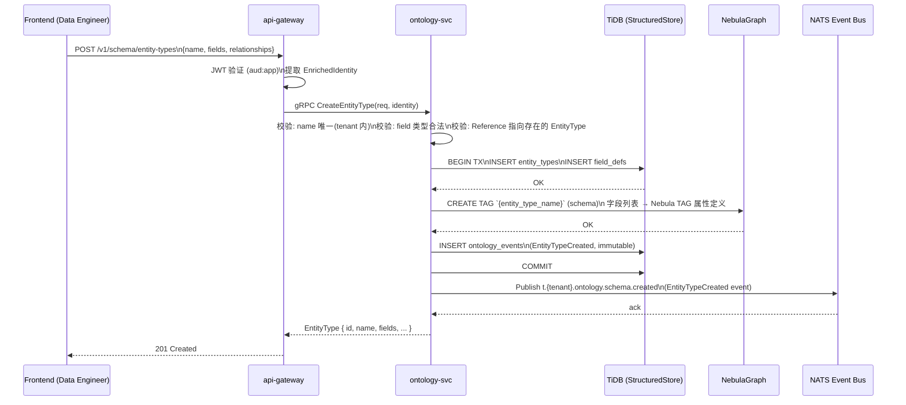
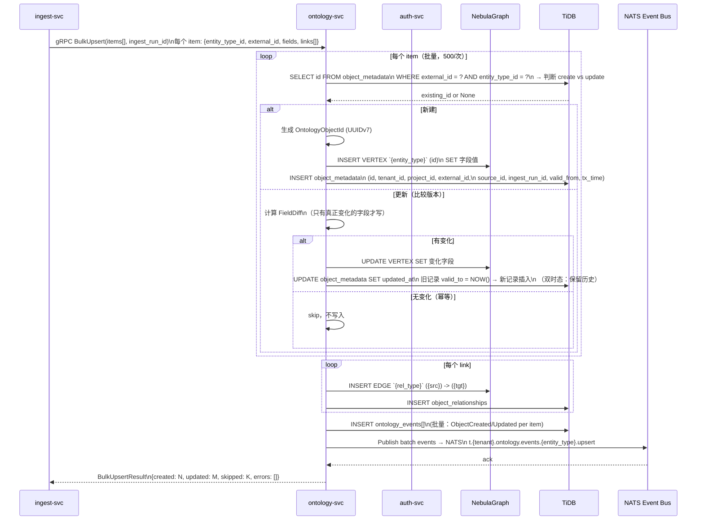
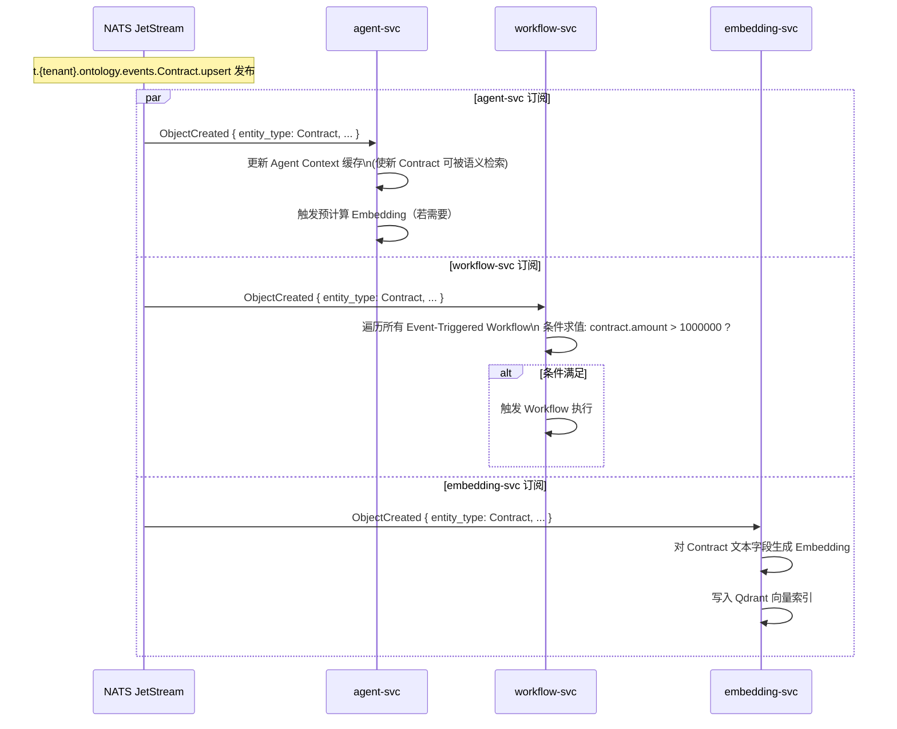
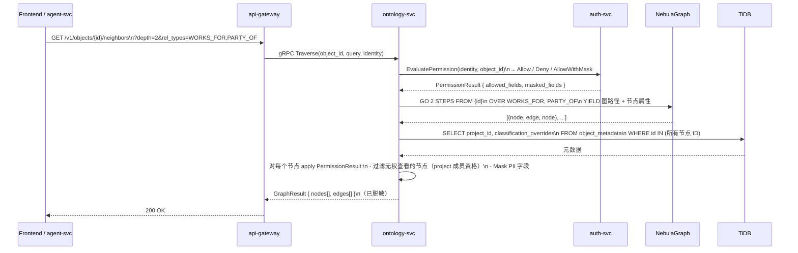
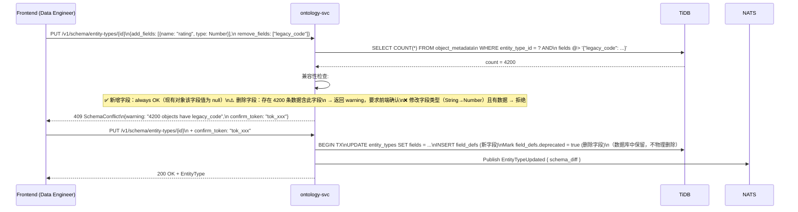

# ontology-svc — 完整设计

> 版本：v0.2.0 | 日期：2026-03-19
> 关联：ADR-27（存储选型）、ADR-28（存储 trait 体系）、ADR-04（多租户）、ADR-26（四粒度权限）
> 前置读物：overview_v0.1.6.md § 存储层

---

## 一、定位

**ontology-svc 是整个平台的 Single Source of Truth。**

所有其他服务要么写入它（ingest-svc 摄入数据），要么读取它（agent-svc 查询数据、workflow-svc 监听事件），要么管理它的 Schema（前端 Data Engineer 工作台）。

```
写入方：ingest-svc、前端（手动创建）、function-svc（计算写回）
读取方：agent-svc、frontend、workflow-svc（触发条件求值）
管理方：Data Engineer（TBox Schema）、Data Governance（字段分类）
监听方：agent-svc、workflow-svc、embedding-svc（订阅事件）
```

---

## 二、用例全集

### Actor: Data Engineer

| ID | 用例 | 触发条件 |
|----|------|---------|
| UC-DE-01 | 定义 EntityType（创建实体类型） | 首次接入某类业务数据 |
| UC-DE-02 | 更新 EntityType（新增/修改字段） | 业务数据结构变化 |
| UC-DE-03 | 删除 EntityType | 废弃业务实体 |
| UC-DE-04 | 定义 RelationshipType（关系类型） | 建立两个实体之间的语义关系 |
| UC-DE-05 | 查看 Schema 全貌（Ontology 图） | 了解当前数据模型 |
| UC-DE-06 | 设置字段分类（Public/Internal/Confidential/PII） | 合规要求（ADR-09） |
| UC-DE-07 | 查看 Schema 变更历史 | 审计/回溯 |

### Actor: ingest-svc（系统账号）

| ID | 用例 | 触发条件 |
|----|------|---------|
| UC-IN-01 | 批量 Upsert OntologyObject | 摄入任务执行 |
| UC-IN-02 | 按 external_id 去重（幂等写入） | 重复运行同一摄入任务 |
| UC-IN-03 | 建立对象间关系（Link） | 外键映射转图边 |
| UC-IN-04 | 写入 Lineage 元数据 | 记录数据来源（source_id + ingest_run_id） |

### Actor: Analyst / Data Scientist（前端查询）

| ID | 用例 | 触发条件 |
|----|------|---------|
| UC-QR-01 | 按 EntityType + 条件过滤查对象列表 | 数据查询页 |
| UC-QR-02 | 按 ID 查对象详情（含关系） | 点击对象 |
| UC-QR-03 | N 跳图遍历（查关联对象） | 查"合同相关的所有人" |
| UC-QR-04 | 全文搜索对象 | 搜索框 |
| UC-QR-05 | 查询对象血缘（数据来源链） | 溯源：此数据从哪里来 |
| UC-QR-06 | 双时态查询（历史状态） | 查"合同在 2026-01-01 时的状态" |

### Actor: agent-svc（系统账号）

| ID | 用例 | 触发条件 |
|----|------|---------|
| UC-AG-01 | 语义搜索对象（配合 embedding-svc） | Agent 自然语言问答 |
| UC-AG-02 | 多跳关系推理查询 | Agent 推理链 |
| UC-AG-03 | 写回 AI 生成的对象（计算结果） | Function 执行结果落地 |

### Actor: Data Governance

| ID | 用例 | 触发条件 |
|----|------|---------|
| UC-DG-01 | 查看字段分类总览 | 合规审查 |
| UC-DG-02 | 变更字段分类 | 合规要求调整 |
| UC-DG-03 | 查看 PII 字段访问日志 | 审计 |

---

## 三、领域模型

### 聚合 / 实体

```
┌─────────────────────────────────────────────────────────────────────┐
│  TBox（Schema 层）                                                   │
│                                                                     │
│  EntityType                     RelationshipType                    │
│  ──────────────────             ──────────────────────              │
│  id: EntityTypeId               id: RelationshipTypeId              │
│  tenant_id: TenantId            tenant_id: TenantId                 │
│  name: String          ◀──┐    name: String  (e.g. WORKS_FOR)      │
│  display_name: String     │    source_entity_type: EntityTypeId ─┐  │
│  description: Option<_>   │    target_entity_type: EntityTypeId ─┤  │
│  fields: Vec<FieldDef>    │    cardinality: Cardinality           │  │
│  icon: Option<String>     │    is_directed: bool                  │  │
│  color: Option<String>    │    properties: Vec<FieldDef>          │  │
│  version: u32             │                                       │  │
│  created_at / updated_at  └───────────────────────────────────────┘  │
│  created_by: UserId                                                 │
│                                                                     │
│  FieldDef（EntityType 的 Value Object）                              │
│  ──────────────────────────────────                                 │
│  id: FieldId                                                        │
│  name: String                                                       │
│  data_type: DataType                                                │
│  is_required: bool                                                  │
│  is_unique: bool                                                    │
│  is_indexed: bool                                                   │
│  classification: FieldClassification   ← 合规驱动                   │
│  description: Option<String>                                        │
│  default_value: Option<FieldValue>                                  │
└─────────────────────────────────────────────────────────────────────┘

┌─────────────────────────────────────────────────────────────────────┐
│  ABox（数据层）                                                      │
│                                                                     │
│  OntologyObject                  ObjectRelationship                 │
│  ──────────────────              ──────────────────────             │
│  id: OntologyObjectId            id: RelationshipId                 │
│  tenant_id: TenantId             tenant_id: TenantId                │
│  project_id: Option<ProjectId>   rel_type_id: RelationshipTypeId    │
│  entity_type_id: EntityTypeId    source_id: OntologyObjectId        │
│  external_id: Option<String>     target_id: OntologyObjectId        │
│  source_system_id: Option<SourceId>  properties: FieldMap           │
│  fields: FieldMap                created_at: DateTime               │
│  version: u64                    created_by: Principal              │
│  valid_from: DateTime   ←── 双时态                                   │
│  valid_to: Option<DateTime>                                         │
│  tx_time: DateTime                                                  │
│  lineage: ObjectLineage                                             │
│  created_at / updated_at                                            │
│  created_by: Principal                                              │
│                                                                     │
│  ObjectLineage（Value Object）                                       │
│  ──────────────────────────────                                     │
│  source_id: Option<SourceId>       ← 来自哪个数据源                  │
│  ingest_run_id: Option<IngestRunId>  ← 哪次摄入                      │
│  function_id: Option<FunctionId>    ← 哪个 Function 计算出来的        │
│  parent_object_ids: Vec<OntologyObjectId>  ← 派生自哪些对象           │
└─────────────────────────────────────────────────────────────────────┘
```

### 值对象

```rust
// 字段类型
pub enum DataType {
    String,
    Number,
    Boolean,
    Date,
    DateTime,
    GeoPoint,
    Reference { entity_type: EntityTypeId },    // 外键引用
    List(Box<DataType>),
    Struct(Vec<FieldDef>),                       // 嵌套结构
}

// 字段值（序列化存储）
pub enum FieldValue {
    Null,
    String(String),
    Number(f64),
    Boolean(bool),
    Date(NaiveDate),
    DateTime(DateTime<Utc>),
    GeoPoint { lat: f64, lon: f64 },
    Reference(OntologyObjectId),
    List(Vec<FieldValue>),
    Struct(HashMap<String, FieldValue>),
}

// 合规分类
pub enum FieldClassification {
    Public,         // 任何人可见
    Internal,       // 租户内可见
    Confidential,   // 需要特定角色
    Pii,            // 个人信息，受 GDPR/合规约束
}

// 关系基数
pub enum Cardinality {
    OneToOne,
    OneToMany,
    ManyToOne,
    ManyToMany,
}
```

### 领域事件

```rust
// 发布到 NATS Subject: t.{tenant_id}.ontology.events.{entity_type}.{action}
pub enum OntologyEvent {
    // ABox 事件
    ObjectCreated {
        tenant_id:      TenantId,
        project_id:     Option<ProjectId>,
        object_id:      OntologyObjectId,
        entity_type:    EntityTypeId,
        snapshot:       FieldMap,            // 全量快照
        lineage:        ObjectLineage,
        occurred_at:    DateTime<Utc>,
    },
    ObjectUpdated {
        tenant_id:      TenantId,
        object_id:      OntologyObjectId,
        entity_type:    EntityTypeId,
        diff:           FieldDiff,           // 仅变更字段
        version_before: u64,
        version_after:  u64,
        occurred_at:    DateTime<Utc>,
    },
    ObjectDeleted {
        tenant_id:      TenantId,
        object_id:      OntologyObjectId,
        entity_type:    EntityTypeId,
        occurred_at:    DateTime<Utc>,
    },
    RelationshipCreated {
        tenant_id:      TenantId,
        rel_type:       RelationshipTypeId,
        source_id:      OntologyObjectId,
        target_id:      OntologyObjectId,
        occurred_at:    DateTime<Utc>,
    },
    RelationshipDeleted {
        tenant_id:      TenantId,
        rel_id:         RelationshipId,
        occurred_at:    DateTime<Utc>,
    },

    // TBox 事件（Schema 变更）
    // Subject: t.{tenant_id}.ontology.schema.{action}
    EntityTypeCreated {
        tenant_id:   TenantId,
        entity_type: EntityType,
        occurred_at: DateTime<Utc>,
    },
    EntityTypeUpdated {
        tenant_id:      TenantId,
        entity_type_id: EntityTypeId,
        schema_diff:    SchemaDiff,
        occurred_at:    DateTime<Utc>,
    },
    FieldClassificationChanged {
        tenant_id:      TenantId,
        entity_type_id: EntityTypeId,
        field_id:       FieldId,
        old_class:      FieldClassification,
        new_class:      FieldClassification,
        occurred_at:    DateTime<Utc>,
    },
}
```

---

## 四、交互图

### Flow A — Data Engineer 定义 EntityType



---

### Flow B — ingest-svc 批量 Upsert（核心写入路径）



---

### Flow C — 事件扩散（ontology-svc → 下游）



---

### Flow D — Agent / 前端图遍历查询



---

### Flow E — Schema 变更兼容性校验（字段新增/删除）



---

## 五、存储模型（NebulaGraph + TiDB）

### NebulaGraph（图存储）

```
Space: nebula://tenant_{tenant_id}

── TBox ──────────────────────────────────────────────────────
Tag（即 EntityType）在 NebulaGraph 中映射为 TAG 类型定义：
  TAG `Contract` (
    external_id   string,
    title         string,
    amount        double,
    signed_date   date,
    status        string
    -- 分类字段不存 Nebula，存 TiDB
  )

Edge Type（RelationshipType）：
  EDGE TYPE `PARTY_OF` (
    role   string,    -- edge 自身属性（可选）
    since  date
  )

── ABox ──────────────────────────────────────────────────────
Vertex（OntologyObject）：
  INSERT VERTEX `Contract` (external_id, title, amount, ...)
    VALUES "obj_01234567":("C-2026-001", "服务合同", 500000.0, ...)

Edge（ObjectRelationship）：
  INSERT EDGE `PARTY_OF` ("obj_01234567" -> "person_98765")
    VALUES "obj_01234567" -> "person_98765"@0: ("甲方", "2026-01-01")

注：NebulaGraph 只存可查询字段，PII 字段加密后存 TiDB StructuredStore
```

### TiDB（结构化 + 元数据存储）

```sql
-- EntityType 定义（TBox 元数据）
CREATE TABLE entity_types (
  id            BINARY(16)   PRIMARY KEY,
  tenant_id     BINARY(16)   NOT NULL,
  name          VARCHAR(128) NOT NULL,
  display_name  VARCHAR(256),
  description   TEXT,
  icon          VARCHAR(64),
  color         CHAR(7),
  version       INT          NOT NULL DEFAULT 1,
  created_at    DATETIME(6)  NOT NULL,
  updated_at    DATETIME(6)  NOT NULL,
  created_by    BINARY(16)   NOT NULL,
  UNIQUE KEY uq_tenant_name (tenant_id, name)
);

-- FieldDef（字段定义，分类合规核心）
CREATE TABLE field_defs (
  id              BINARY(16)   PRIMARY KEY,
  entity_type_id  BINARY(16)   NOT NULL,
  tenant_id       BINARY(16)   NOT NULL,
  name            VARCHAR(128) NOT NULL,
  data_type       VARCHAR(64)  NOT NULL,     -- JSON 序列化 DataType
  is_required     BOOLEAN      NOT NULL DEFAULT FALSE,
  is_unique       BOOLEAN      NOT NULL DEFAULT FALSE,
  is_indexed      BOOLEAN      NOT NULL DEFAULT FALSE,
  is_deprecated   BOOLEAN      NOT NULL DEFAULT FALSE,
  classification  ENUM('Public','Internal','Confidential','Pii') NOT NULL DEFAULT 'Internal',
  description     TEXT,
  default_value   JSON,
  sort_order      SMALLINT     NOT NULL DEFAULT 0,
  INDEX idx_entity_type (entity_type_id)
);

-- RelationshipType
CREATE TABLE relationship_types (
  id                   BINARY(16) PRIMARY KEY,
  tenant_id            BINARY(16) NOT NULL,
  name                 VARCHAR(128) NOT NULL,
  source_entity_type   BINARY(16) NOT NULL,
  target_entity_type   BINARY(16) NOT NULL,
  cardinality          ENUM('OneToOne','OneToMany','ManyToOne','ManyToMany') NOT NULL,
  is_directed          BOOLEAN NOT NULL DEFAULT TRUE,
  UNIQUE KEY uq_tenant_name (tenant_id, name)
);

-- 对象元数据（ABox 元数据，不含业务字段）
CREATE TABLE object_metadata (
  id              BINARY(16)   PRIMARY KEY,        -- OntologyObjectId (UUIDv7)
  tenant_id       BINARY(16)   NOT NULL,
  project_id      BINARY(16),                      -- NULL = 租户共享
  entity_type_id  BINARY(16)   NOT NULL,
  external_id     VARCHAR(512),                    -- 来自 source system
  source_id       BINARY(16),                      -- 数据源
  ingest_run_id   BINARY(16),                      -- 摄入批次
  function_id     BINARY(16),                      -- 派生来源
  version         BIGINT       NOT NULL DEFAULT 1,
  valid_from      DATETIME(6)  NOT NULL,            -- 双时态有效期起
  valid_to        DATETIME(6),                     -- NULL = 当前有效
  tx_time         DATETIME(6)  NOT NULL,            -- 事务时间
  created_by      BINARY(16),
  INDEX idx_tenant_type        (tenant_id, entity_type_id),
  INDEX idx_external_id        (tenant_id, entity_type_id, external_id),
  INDEX idx_project            (project_id),
  INDEX idx_valid              (valid_from, valid_to)
);

-- PII 字段加密存储（仅 PII 分类字段）
CREATE TABLE encrypted_fields (
  object_id   BINARY(16)   NOT NULL,
  field_id    BINARY(16)   NOT NULL,
  ciphertext  BLOB         NOT NULL,    -- AES-256-GCM 加密
  dek_id      VARCHAR(128) NOT NULL,    -- KMS 密钥 ID (Crypto-Shredding)
  iv          BINARY(12)   NOT NULL,
  PRIMARY KEY (object_id, field_id)
);

-- 不可篡改事件日志（双写，ADR-09）
CREATE TABLE ontology_events (
  seq         BIGINT       AUTO_INCREMENT PRIMARY KEY,
  tenant_id   BINARY(16)   NOT NULL,
  event_type  VARCHAR(64)  NOT NULL,
  entity_type VARCHAR(128),
  object_id   BINARY(16),
  payload     JSON         NOT NULL,
  prev_hash   BINARY(32)   NOT NULL,    -- 哈希链（防篡改）
  hash        BINARY(32)   NOT NULL,
  occurred_at DATETIME(6)  NOT NULL,
  INDEX idx_tenant_time (tenant_id, occurred_at),
  INDEX idx_object      (object_id)
) COMMENT='WORM append-only, no UPDATE/DELETE';
```

---

## 六、核心 Rust Trait 层

### 存储 Trait（`palantir-ontology-core` crate）

```rust
// ── TBox 存储 ─────────────────────────────────────────────────────
#[async_trait]
pub trait SchemaStore: Send + Sync {
    async fn create_entity_type(
        &self,
        tenant_id: TenantId,
        req: CreateEntityTypeRequest,
        by: Principal,
    ) -> Result<EntityType>;

    async fn get_entity_type(
        &self,
        tenant_id: TenantId,
        id: EntityTypeId,
    ) -> Result<Option<EntityType>>;

    async fn list_entity_types(
        &self,
        tenant_id: TenantId,
    ) -> Result<Vec<EntityType>>;

    async fn update_entity_type(
        &self,
        tenant_id: TenantId,
        id: EntityTypeId,
        patch: EntityTypePatch,
        by: Principal,
    ) -> Result<EntityType>;

    async fn delete_entity_type(
        &self,
        tenant_id: TenantId,
        id: EntityTypeId,
    ) -> Result<()>;

    async fn create_relationship_type(
        &self,
        tenant_id: TenantId,
        req: CreateRelationshipTypeRequest,
    ) -> Result<RelationshipType>;

    async fn list_relationship_types(
        &self,
        tenant_id: TenantId,
    ) -> Result<Vec<RelationshipType>>;
}

// ── ABox 对象存储 ──────────────────────────────────────────────────
#[async_trait]
pub trait ObjectStore: Send + Sync {
    /// 单对象创建
    async fn create_object(
        &self,
        tenant_id: TenantId,
        req: CreateObjectRequest,
        by: Principal,
    ) -> Result<OntologyObject>;

    /// 幂等 Upsert（按 external_id 去重）
    async fn upsert_object(
        &self,
        tenant_id: TenantId,
        req: UpsertObjectRequest,
    ) -> Result<UpsertResult>;

    /// 批量 Upsert（ingest-svc 调用）
    async fn bulk_upsert(
        &self,
        tenant_id: TenantId,
        items: Vec<UpsertObjectRequest>,
        ingest_run_id: IngestRunId,
    ) -> Result<BulkUpsertResult>;

    async fn get_object(
        &self,
        tenant_id: TenantId,
        id: OntologyObjectId,
    ) -> Result<Option<OntologyObject>>;

    async fn update_object(
        &self,
        tenant_id: TenantId,
        id: OntologyObjectId,
        patch: ObjectPatch,
        by: Principal,
    ) -> Result<OntologyObject>;

    async fn delete_object(
        &self,
        tenant_id: TenantId,
        id: OntologyObjectId,
        by: Principal,
    ) -> Result<()>;

    async fn query_objects(
        &self,
        tenant_id: TenantId,
        query: ObjectQuery,
    ) -> Result<PagedResult<OntologyObject>>;

    /// 双时态：查询对象在 as_of 时刻的状态
    async fn get_object_at(
        &self,
        tenant_id: TenantId,
        id: OntologyObjectId,
        as_of: DateTime<Utc>,
    ) -> Result<Option<OntologyObject>>;
}

// ── 图遍历存储 ─────────────────────────────────────────────────────
#[async_trait]
pub trait GraphStore: Send + Sync {
    async fn create_relationship(
        &self,
        tenant_id: TenantId,
        req: CreateRelationshipRequest,
        by: Principal,
    ) -> Result<ObjectRelationship>;

    async fn delete_relationship(
        &self,
        tenant_id: TenantId,
        id: RelationshipId,
    ) -> Result<()>;

    async fn traverse(
        &self,
        tenant_id: TenantId,
        start: OntologyObjectId,
        query: TraversalQuery,
    ) -> Result<GraphResult>;

    async fn get_neighbors(
        &self,
        tenant_id: TenantId,
        id: OntologyObjectId,
        rel_types: Option<Vec<RelationshipTypeId>>,
        direction: EdgeDirection,
    ) -> Result<Vec<NeighborResult>>;

    async fn get_lineage(
        &self,
        tenant_id: TenantId,
        id: OntologyObjectId,
        direction: LineageDirection,  // Upstream | Downstream | Both
        depth: u8,
    ) -> Result<LineageGraph>;
}

// ── 查询参数类型 ───────────────────────────────────────────────────
pub struct ObjectQuery {
    pub entity_type_id: Option<EntityTypeId>,
    pub project_id:     Option<ProjectId>,
    pub filters:        Vec<FieldFilter>,
    pub full_text:      Option<String>,
    pub order_by:       Vec<OrderByField>,
    pub as_of:          Option<DateTime<Utc>>,  // 双时态
    pub page:           PageParams,
}

pub struct TraversalQuery {
    pub rel_types:  Option<Vec<RelationshipTypeId>>,
    pub direction:  EdgeDirection,   // Outgoing | Incoming | Both
    pub max_depth:  u8,              // 最多 5，防止全图遍历
    pub filters:    Vec<FieldFilter>,
    pub limit:      usize,
}

pub enum EdgeDirection { Outgoing, Incoming, Both }
pub enum LineageDirection { Upstream, Downstream, Both }
```

### 应用服务层（ontology-svc 内部）

```rust
/// OntologyService 协调存储 + 权限 + 事件发布
pub struct OntologyService {
    schema_store: Arc<dyn SchemaStore>,
    object_store: Arc<dyn ObjectStore>,
    graph_store:  Arc<dyn GraphStore>,
    event_pub:    Arc<dyn EventPublisher>,
    permission:   Arc<dyn PermissionEvaluator>,   // auth-svc 客户端
}

impl OntologyService {
    /// 创建对象（权限前置检查 + 事件后置发布）
    pub async fn create_object(
        &self,
        identity: &EnrichedIdentity,
        req: CreateObjectRequest,
    ) -> Result<OntologyObject> {
        // 1. 权限检查（RBAC + Project）
        self.permission
            .check(identity, &ResourceRef::EntityType(req.entity_type_id), Action::Write)
            .await?;

        // 2. Schema 校验（字段类型、required 检查）
        let schema = self.schema_store
            .get_entity_type(identity.tenant_id, req.entity_type_id)
            .await?
            .ok_or(Error::EntityTypeNotFound)?;
        schema.validate_fields(&req.fields)?;

        // 3. 写入
        let obj = self.object_store
            .create_object(identity.tenant_id, req, identity.as_principal())
            .await?;

        // 4. 发布事件（异步，不阻塞响应）
        let event = OntologyEvent::ObjectCreated { ... };
        self.event_pub.publish(event).await?;

        Ok(obj)
    }

    /// 带权限过滤的图遍历
    pub async fn traverse(
        &self,
        identity: &EnrichedIdentity,
        start_id: OntologyObjectId,
        query: TraversalQuery,
    ) -> Result<GraphResult> {
        // 1. 检查 start 对象权限
        let result = self.permission
            .check(identity, &ResourceRef::Object(start_id), Action::Read)
            .await?;
        if result == PermissionResult::Deny { return Err(Error::NotFound); } // 404 不泄露存在

        // 2. 图遍历
        let raw = self.graph_store
            .traverse(identity.tenant_id, start_id, query)
            .await?;

        // 3. 对每个节点过滤权限 + mask PII 字段
        let filtered = self.filter_graph_result(identity, raw).await?;

        Ok(filtered)
    }
}
```

---

## 七、API 接口（HTTP REST via api-gateway）

```
── TBox (Schema) ─────────────────────────────────────────────────────
POST   /v1/schema/entity-types              创建 EntityType
GET    /v1/schema/entity-types              列出（租户内）
GET    /v1/schema/entity-types/{id}         详情
PUT    /v1/schema/entity-types/{id}         更新（含兼容性校验）
DELETE /v1/schema/entity-types/{id}         删除（需无实例）

GET    /v1/schema/entity-types/{id}/history Schema 变更历史

POST   /v1/schema/relationship-types        创建 RelationshipType
GET    /v1/schema/relationship-types        列出
DELETE /v1/schema/relationship-types/{id}   删除

── ABox (Objects) ────────────────────────────────────────────────────
POST   /v1/objects                          创建对象
GET    /v1/objects/{id}                     查询对象
PUT    /v1/objects/{id}                     更新对象（patch）
DELETE /v1/objects/{id}                     删除对象

GET    /v1/objects                          列表查询（带过滤、分页）
GET    /v1/objects/{id}/history             对象历史版本（双时态）
GET    /v1/objects/{id}/lineage             血缘图

── 关系 ──────────────────────────────────────────────────────────────
POST   /v1/links                            建立关系
DELETE /v1/links/{id}                       删除关系
GET    /v1/objects/{id}/neighbors           邻居（1跳，快速接口）
POST   /v1/graph/traverse                   N 跳遍历（复杂查询）

── 批量（ingest-svc 专用）────────────────────────────────────────────
POST   /v1/internal/objects/bulk-upsert     批量 Upsert（服务账号 Token）

── 事件流（前端 SSE）─────────────────────────────────────────────────
GET    /v1/events/stream                    SSE：实时 ontology 变更推送

── 元信息 ────────────────────────────────────────────────────────────
GET    /v1/schema/graph                     完整 Schema 图（Ontology 可视化用）
```

---

## 八、NebulaGraph nGQL 核心语句参考

```sql
-- 创建 Space（Tenant 隔离）
CREATE SPACE IF NOT EXISTS `tenant_acme`
  (partition_num = 10, replica_factor = 1, vid_type = FIXED_STRING(36));

-- 创建 EntityType TAG
USE `tenant_acme`;
CREATE TAG IF NOT EXISTS `Contract` (
  external_id  string,
  title        string  DEFAULT "",
  amount       double  DEFAULT 0.0,
  status       string  DEFAULT "draft",
  signed_date  date
);

-- 创建 RelationshipType EDGE TYPE
CREATE EDGE IF NOT EXISTS `PARTY_OF` (
  role   string DEFAULT "",
  since  date
);

-- 插入对象
INSERT VERTEX `Contract` (external_id, title, amount, status)
  VALUES "obj_uuid_001":("C-2026-001", "技术服务协议", 500000.0, "signed");

-- 建立关系
INSERT EDGE `PARTY_OF` (role)
  VALUES "obj_uuid_001" -> "person_uuid_alice":("甲方");

-- N 跳遍历（合同 → 所有相关人）
GO 2 STEPS FROM "obj_uuid_001" OVER `PARTY_OF`, `WORKS_FOR`
  YIELD DISTINCT $$.Person.name AS name,
                 $$.Person.email AS email,
                 $^.Contract.title AS contract_title;

-- 血缘查询（找谁创建了此合同）
FIND PATH FROM "obj_uuid_001" TO "source_uuid_erp" OVER *
  UPTO 5 STEPS;
```

---

## 九、实现顺序（P0 → P2）

```
P0（骨架可运行）：
  ✅ SchemaStore trait + TiDB 实现（只做 entity_types + field_defs）
  ✅ ObjectStore trait + TiDB 实现（object_metadata + NebulaGraph vertex）
  ✅ BulkUpsert（ingest-svc 需要）
  ✅ 基础 Graph 查询（Neighbors 1 跳）
  ✅ OntologyEvent 发布（InProcess EventBus，NATS 替换留接口）

P1（核心可用）：
  ☐ N 跳图遍历（GO N STEPS）
  ☐ FieldClassification + encrypted_fields（PII 加密）
  ☐ 对象历史版本（双时态查询）
  ☐ Schema 兼容性校验（删字段警告）
  ☐ 血缘图（Lineage）
  ☐ SSE 事件流（前端实时推送）

P2（高级功能）：
  ☐ 全文搜索（TiDB 全文索引 或 Meilisearch 接入）
  ☐ 三路合并（离线同步，/v1/sync）
  ☐ WORM 事件哈希链（合规审计）
  ☐ ontology_events 导出到 WORM 存储
```

---

## 待讨论

- [ ] NebulaGraph TAG 与 TiDB 的写入顺序：先写 Nebula 还是先写 TiDB？（建议：先 TiDB 记元数据，Nebula 写失败则补偿）
- [ ] 双时态查询的分页策略（历史版本膨胀后的 valid_from/valid_to 索引优化）
- [ ] bulk_upsert 的批大小：500/次是否合适，还是由 ingest-svc 动态传入？

---

## 版本历史

| 版本 | 日期 | 变更内容 |
|------|------|---------|
| v0.1.0 | 2026-03-19 | 初始骨架（SurrealDB 存储模型，待细化）|
| v0.2.0 | 2026-03-19 | 完整设计：用例全集、领域模型、5 个交互图、NebulaGraph+TiDB 存储模型、核心 Rust Trait 层、实现顺序 |
